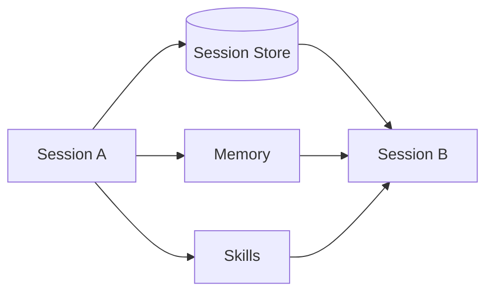
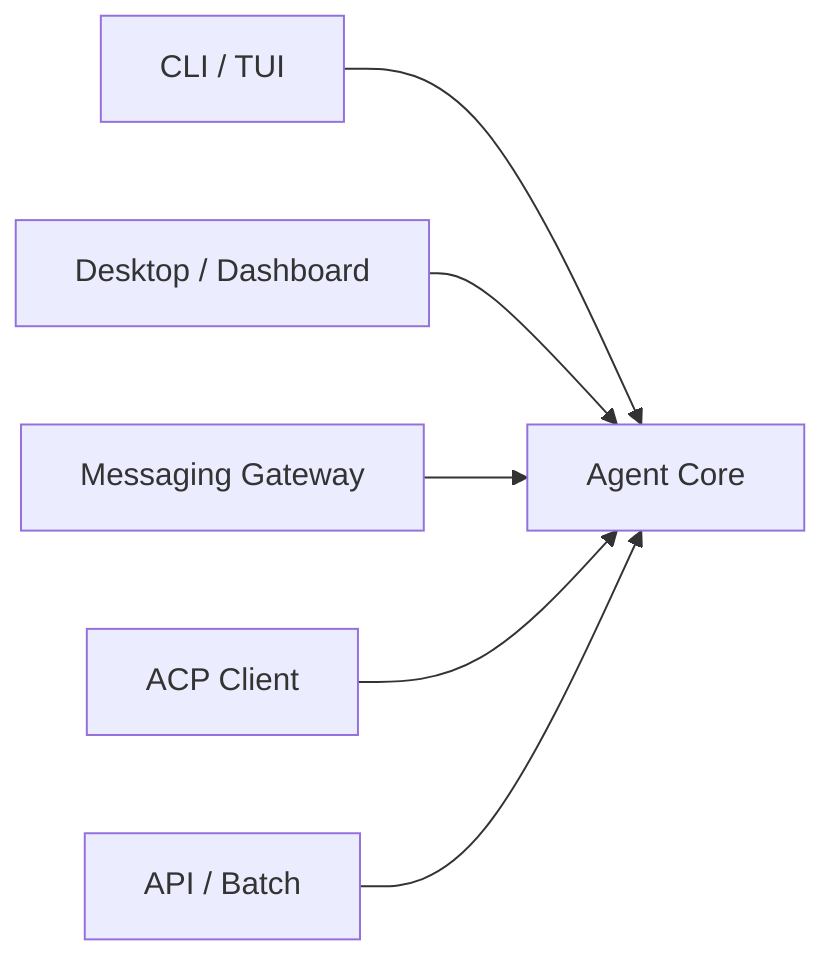
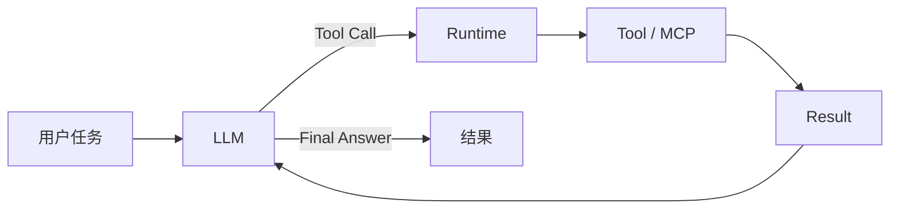
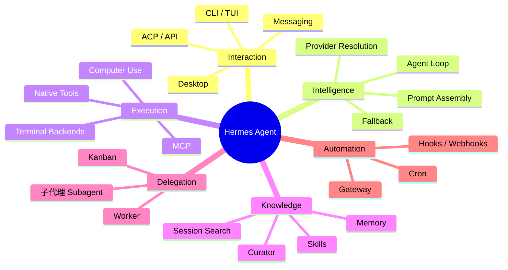
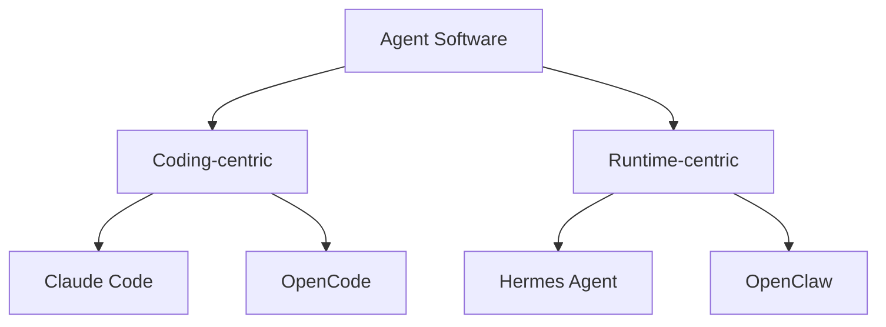

# 01 · Hermes Agent 是什么

> **目标**：用 10 分钟建立对 Hermes Agent 的整体认识。  
> **事实边界**：本篇只讨论相对稳定的产品定位和架构思想，不维护 Provider、平台或 Tool 的精确数量。

> **事实核验基线**：2026-07-21；术语规范见 [reference/terminology.md](./reference/terminology.md)。

## 1. 一句话定义

**Hermes Agent 是一个开源的个人 AI Agent Runtime。**

它把 LLM 放进一个长期运行的执行环境里，让同一个 Agent 核心能够：

- 接收来自 CLI、桌面应用、消息平台、ACP/API 等不同入口的请求；
- 调用文件、终端、浏览器、MCP 等工具；
- 使用 Skills 获取按需加载的程序性知识；
- 保存 Memory，并搜索历史 Session；
- 把任务委派给子代理（Subagent）；
- 使用 Cron 和 Kanban 处理定时或持久化工作；
- 在模型、Provider 与执行后端之间保持相对解耦。

因此，Hermes 不应只被理解成“另一个聊天机器人”或“另一个 Coding Agent”。

## 2. Hermes 主要解决什么问题

### 2.1 让 Agent 不再绑定一次对话

普通 LLM 对话往往以当前上下文窗口为边界。Hermes 把 Session、Memory、Skills 和历史检索放到 Runtime 层，使 Agent 可以在不同 Session 之间保持一定连续性。



这里的“连续性”并不意味着 LLM 参数被在线训练，而是**外部状态被持续保存和重新注入**。

### 2.2 让同一个 Agent 出现在不同入口

Hermes 的入口可以是终端，也可以是消息 Gateway、桌面 UI 或编辑器协议。



入口的职责是接收与投递；Agent 的核心推理和工具循环尽量保持统一。

### 2.3 让“会回答”变成“会执行”

Hermes 的 Agent Loop 不只生成文本，还可以根据模型输出执行 Tool Call，再把 Tool Result 放回上下文继续推理。



### 2.4 让模型成为可替换的认知引擎

Hermes 的长期状态主要存在 Runtime，而不是绑定在某一个模型权重里。

因此可以把系统粗略理解成：

```text
LLM = 当前使用的认知引擎
Hermes Runtime = 工具、状态、会话、技能与运行生命周期
```

更换模型并不会自动删除已有的 Session、Memory 或 Skill。

## 3. 核心能力地图



## 4. Hermes 不是什么

### 4.1 不是安全 Sandbox

**Profile 是状态隔离，不等于文件系统或操作系统级安全隔离。**

不同 Profile 可以拥有独立的配置、Memory、Session、Skills 和 Gateway 状态，但只要底层工具仍能访问同一宿主机文件系统，就不能把 Profile 当成安全边界。

### 4.2 不是 IDE

Hermes 可以写代码、运行测试、操作 Git，但它的核心定位不是替代编辑器的 LSP、语法高亮、行内诊断和手工编辑体验。

### 4.3 不是“自动训练自己的模型”

Hermes 的在线 self-improvement 主要发生在：

- Memory 更新；
- Skill 创建与修改；
- Session 历史检索；
- Curator 对 Skill 库的维护。

这和直接修改 GPT、Claude 或其他基础模型的神经网络权重是两回事。

### 4.4 不是完全无人监督的“数字员工”

Hermes 可以运行高权限工具，因此是否允许危险命令、是否允许 Agent 自主写 Memory/Skill、是否开放 Gateway，都应该由用户明确设计权限边界。

## 5. Hermes 在 Agent 生态中的位置

更合理的比较方式，不是简单列“谁有多少功能”，而是看系统的**主要优化目标**。



这不是绝对分类。Claude Code 和 OpenCode 也拥有 Skills、Subagents、MCP 与持久化 Session；Hermes 也能承担 Coding 工作。

区别更接近：

- **Coding-centric**：优先把软件工程交互做到深。
- **Runtime-centric**：优先把长期运行、跨入口、持久状态、自动化和外部协作做成系统能力。

## 6. 三条值得记住的设计思想

### Prompt caching 很重要

长会话中，稳定的 Prompt 前缀有助于重复利用缓存。Hermes 因此会尽量避免在同一 Session 中无意义地重建整个 System Prompt 或 Tool Surface。

### Core is a narrow waist

核心 Tool Surface 越大，每次模型请求携带的 Schema 越重。新的能力优先通过 Skill、Plugin、MCP 或受条件启用的 Tool 加入，而不是无限扩张核心。

### State goes with its authority

真正会被多个 Surface 修改的状态，应由后端持有权威；前端更多是后端事实的视图或缓存。

## 7. 适合哪些人

Hermes 特别适合：

- 想长期运行一个可自托管 Agent 的用户；
- 希望从手机或消息平台触发本机/服务器 Agent 的用户；
- 需要把 Agent 接到定时任务、外部工具和工作流的人；
- 想研究 Agent Runtime、Prompt Engineering、Memory 与多代理编排（Multi-Agent Orchestration）的开发者；
- 希望模型可替换，而长期状态不依赖单一 SaaS 的用户。

只需要偶尔写代码或临时问答时，专门的 Coding Agent 或 SaaS Chatbot 可能更直接。

## 8. 接下来

下一篇先不深入源码，而是把 Hermes 真正跑起来：

→ [02-quickstart.md](./02-quickstart.md)

### 参考

- Hermes Architecture: `https://hermes-agent.nousresearch.com/docs/developer-guide/architecture`
- Hermes Agent Loop: `https://hermes-agent.nousresearch.com/docs/developer-guide/agent-loop`
- Hermes 官方仓库: `https://github.com/NousResearch/hermes-agent`
