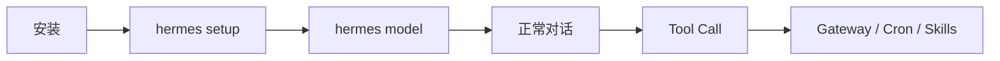
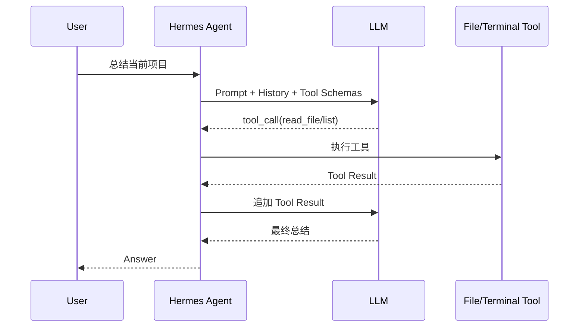

# 02 · 安装与快速上手

> **目标**：完成安装、首次配置、第一次对话和第一次 Tool Call。  
> **事实核验基线**：2026-07-21。Hermes CLI 变化较快，遇到差异时以当前官方 CLI Reference 为准。

## 1. 最短路径

建议按这个顺序：



原则很简单：

> **先让一次普通对话稳定工作，再叠加 Gateway、Cron、Skills、Fallback 和多代理。**

## 2. 安装

### Linux / macOS / WSL2 / Termux

```bash
curl -fsSL https://hermes-agent.nousresearch.com/install.sh | bash
```

安装完成后重新加载 Shell：

```bash
source ~/.bashrc
# 或
source ~/.zshrc
```

然后启动：

```bash
hermes
```

### Windows PowerShell

```powershell
iex (irm https://hermes-agent.nousresearch.com/install.ps1)
```

当前官方安装器会负责大部分运行依赖。Linux 环境至少应先准备 Git；详细前置条件以官方 Installation 页面为准。

## 3. 首次配置

最推荐：

```bash
hermes setup
```

如果使用 Nous Portal 的整合路径，官方还提供：

```bash
hermes setup --portal
```

也可以分别配置：

```bash
hermes model
hermes tools
hermes gateway setup
```

不要在 Quickstart 阶段一次性配置所有高级能力。先确认基础聊天可用。

## 4. 第一次对话

进入交互模式：

```bash
hermes
```

也可以使用单次 Query：

```bash
hermes chat -q "请用一句话介绍当前工作目录"
```

注意：

```text
-p / --profile
```

是 Profile 选择参数，不是 Prompt 参数。

例如：

```bash
hermes -p work chat -q "总结当前项目"
```

## 5. 第一次 Tool Call

第一次建议选一个低风险任务，例如：

> 列出当前目录结构，读取 README，并用三点总结项目。

你应该观察到类似的逻辑：



这一步是后续理解 Agent Loop 的基础。

## 6. 基本诊断

查看整体状态：

```bash
hermes status
```

检查配置与依赖：

```bash
hermes doctor
```

查看日志：

```bash
hermes logs
```

Gateway 状态：

```bash
hermes gateway status
```

开发或容器环境中，也可以以前台方式运行 Gateway：

```bash
hermes gateway run
```

## 7. 配置 Provider 与凭证

当前 Hermes 使用 Credential Pool 体系管理凭证。

交互式管理：

```bash
hermes auth
```

查看凭证：

```bash
hermes auth list
```

添加 API Key 的典型形式：

```bash
hermes auth add openrouter --api-key <YOUR_KEY>
```

支持 OAuth 的 Provider 可使用：

```bash
hermes auth add anthropic --type oauth
```

具体 Provider 名称和认证方式可能变化，优先使用：

```bash
hermes model
hermes auth
```

的交互式入口。

## 8. Profile：先知道它存在

Profile 是独立的 `$HERMES_HOME`（Hermes 状态根目录）。

创建：

```bash
hermes profile create coder
```

配置：

```bash
coder setup
```

使用：

```bash
coder chat
```

或者：

```bash
hermes -p coder chat -q "Hello"
```

不同 Profile 可以拥有各自的：

- `config.yaml`
- `.env`
- `SOUL.md`
- Memory
- Sessions
- Skills
- Cron
- Gateway state

但请记住：

> **Profile 是状态隔离，不是 OS Sandbox。**

## 9. Gateway：基础聊天稳定后再启用

配置消息平台：

```bash
hermes gateway setup
```

在 Linux/macOS 上，`start` 只会启动**已经安装**的 systemd/launchd 服务，因此首次启用后台服务应先执行：

```bash
hermes gateway install
hermes gateway start
hermes gateway status
```

后续可使用：

```bash
hermes gateway restart
hermes gateway stop
hermes gateway uninstall   # 不再需要后台服务时
```

在 WSL、Docker、Termux 或调试场景，更常见的是以前台方式运行：

```bash
hermes gateway run
```

平台列表变化很快，因此本 Wiki 不维护“全部平台精确清单”。

## 10. Docker

Hermes 官方镜像使用 `/opt/data` 保存持久状态。

首次配置（把配置写入宿主机 `~/.hermes`）：

```bash
mkdir -p ~/.hermes
docker run -it --rm \
  -v ~/.hermes:/opt/data \
  nousresearch/hermes-agent setup
```

配置完成后，可另起一次交互式聊天：

```bash
docker run -it --rm \
  -v ~/.hermes:/opt/data \
  nousresearch/hermes-agent
```

持久 Gateway：

```bash
docker run -d \
  --name hermes \
  --restart unless-stopped \
  -v ~/.hermes:/opt/data \
  -p 8642:8642 \
  nousresearch/hermes-agent gateway run
```

端口 `8642` 对应 Gateway 的 OpenAI-compatible API/健康检查；只使用消息平台时可以不发布该端口。Dashboard 使用独立的 `9119`，并需要显式启用与配置认证。

不要让两个 Hermes Gateway 容器同时写同一个数据目录。

## 11. 一个推荐的 15 分钟练习

依次完成：

```text
1. hermes setup
2. hermes model
3. hermes chat -q "你好"
4. 进入交互会话
5. 让 Hermes 读取一个 README
6. hermes status
7. hermes doctor
```

然后再尝试：

```text
Profile
→ Skill
→ Gateway
→ Cron
→ 子代理（Subagent）/ Kanban
```

## 12. 常见问题

### 对话都不稳定，就开始配置 Gateway

先回到基础对话。Gateway 只会增加更多变量。

### 把 Agent Tool API 当成用户 CLI

例如 Agent 内部可能使用 `skill_manage` 修改 Skill；这不等价于存在同名的 Shell CLI。

用户级 Skill 管理入口是：

```bash
hermes skills
```

### 把 Dashboard 和 Gateway API 端口混为一谈

Dashboard 与 Gateway/API 是不同 Surface。部署时要分别确认监听地址、认证与端口。

## 13. 下一步

→ [03-core-concepts.md](./03-core-concepts.md)

### 参考

- Installation: `https://hermes-agent.nousresearch.com/docs/getting-started/installation`
- Quickstart: `https://hermes-agent.nousresearch.com/docs/getting-started/quickstart`
- CLI Reference: `https://hermes-agent.nousresearch.com/docs/reference/cli-commands`
- Docker: `https://hermes-agent.nousresearch.com/docs/user-guide/docker`
