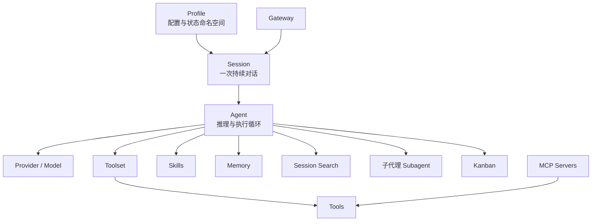
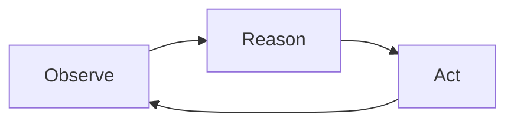
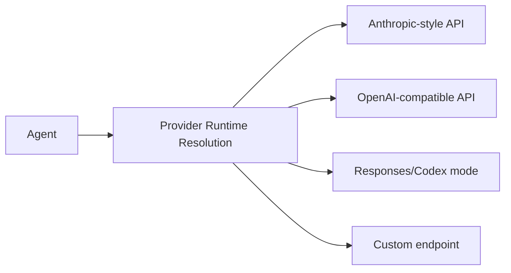
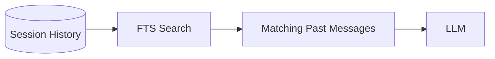
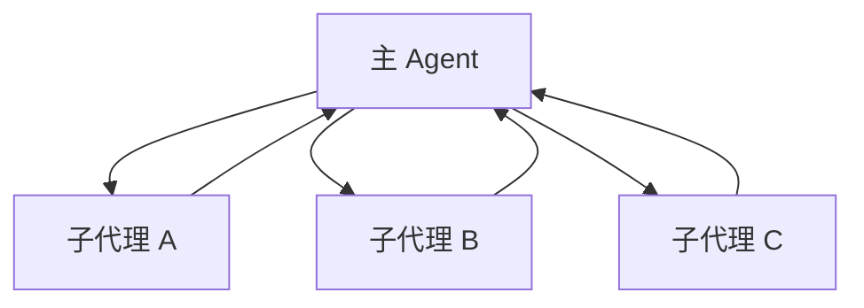
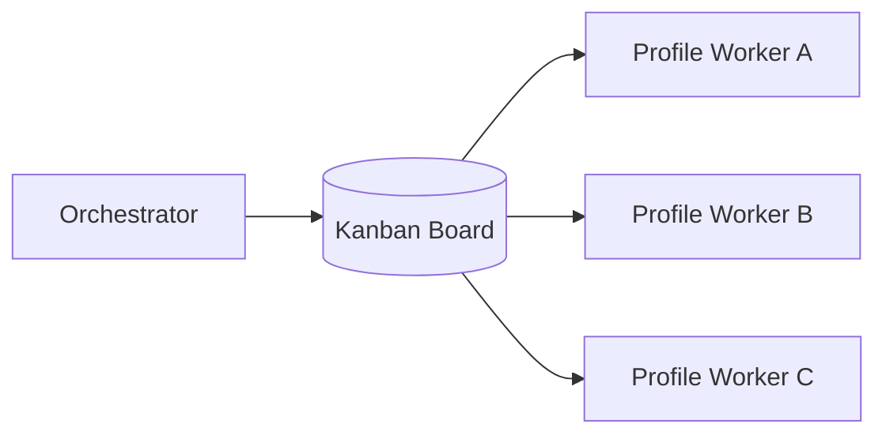

# 03 · 核心概念

> **目标**：在进入 Agent Loop 和源码前，先统一术语。

> **事实核验基线**：2026-07-21；术语规范见 [reference/terminology.md](./reference/terminology.md)。

## 1. 一张概念关系图



## 2. Profile

Profile 是一个独立的 `$HERMES_HOME`。

它通常拥有自己的：

- 配置；
- 凭证视图；
- `SOUL.md`；
- Memory；
- Sessions；
- Skills；
- Cron；
- State DB；
- Gateway state。

默认 Profile 的 `$HERMES_HOME` 通常是 `~/.hermes/`；命名 Profile 通常位于 `~/.hermes/profiles/<name>/`。

### Profile 不是什么

Profile **不是安全 Sandbox**。

它隔离的是 Hermes 状态命名空间，不自动隔离：

- 宿主机用户权限；
- 文件系统；
- 网络；
- SSH 凭证；
- Docker Socket；
- 其他进程。

需要真正执行隔离时，应考虑 Docker、SSH、Modal、Singularity 等执行后端或独立主机。

## 3. Session

Session 是一段持续对话及其历史。

它不只是一个 UI 聊天窗口，而是 Agent Loop 的上下文载体。

一个 Session 中可能包含：

```text
User Message
Assistant Message
Tool Call
Tool Result
Compression Summary
Session Metadata
```

Hermes 会把 Session 持久化，并支持历史搜索和恢复。

## 4. Agent

Agent 是“模型 + Runtime 能力”的组合执行体。

最简模型：



LLM 负责决定下一步；Runtime 负责真正执行工具、持久化状态、路由消息并管理循环。

## 5. Provider 与 Model

**Model** 是具体模型。  
**Provider** 是访问模型的运行时适配层或服务来源。



同一个 Agent Runtime 可以在不同 Provider/Model 之间切换，而 Session、Memory、Skill 等长期资产仍由 Hermes 管理。

## 6. Tool 与 Toolset

### Tool

Tool 是：

> **Agent 能做什么。**

例如：

- 读文件；
- 执行命令；
- 搜索历史 Session；
- 操作 Memory；
- 调用 MCP；
- 委派子任务。

### Toolset

Toolset 是一组 Tool 的集合或预设。

Tool Schema 会占用模型请求上下文，因此 Tool Surface 不是越大越好。

这也是 Narrow Waist 原则的重要原因之一。

## 7. Skill

Skill 是：

> **Agent 应该怎样做某类事情。**

它通常是一份 `SKILL.md`，还可以附带：

```text
references/
scripts/
templates/
assets/
```

Tool 与 Skill 的区别：

| | Tool | Skill |
|---|---|---|
| 解决问题 | 能力 | 方法 |
| 例子 | `terminal` | “安全同步长期 Fork 的 SOP” |
| 进入上下文 | Schema | 通常按需加载正文 |
| 是否可执行 | Tool 本身执行 | Skill 可指导调用 Tool，也可携带脚本 |

一句话：

> **Tool 是手；Skill 是做事的方法。**

## 8. Memory

Memory 保存少量、精选、跨 Session 有长期价值的信息。

可以先理解成：

> **“我长期知道什么。”**

Hermes 内置 Memory 的核心文件包括：

- `MEMORY.md`
- `USER.md`

它们在 Session 开始时以快照形式进入 System Prompt。

## 9. Session Search

Session Search 保存的不是“提炼后的事实”，而是对历史对话的按需回查能力。

> **“我过去经历过什么。”**



Memory 与 Session Search 是互补关系：

| 场景 | 更适合 |
|---|---|
| 用户一直偏好 TypeScript | Memory |
| 三周前我们为什么做了某个架构决策 | Session Search |

## 10. 子代理（Subagent）

子代理是由主 Agent 通过 `delegate_task` 派生出的子 `AIAgent` 执行实例。官方实现具有几个关键语义：

- 使用全新的会话上下文；
- 不继承父会话历史，父 Agent 必须在 `goal` 与 `context` 中显式传入必要信息；
- 继承经过约束的工具访问，并拥有自己的 Terminal Session；
- 最终只有结果摘要进入父 Agent 的上下文；
- 顶层委派默认可后台运行，并以 Handle/结果消息回传。



子代理是**临时任务委派原语**，不是完整的长期协作系统。

## 11. Worker 与 Kanban

Kanban 解决的是比一次性子代理更长期的问题。Hermes 当前将它定义为跨 Profile 共享的持久化多代理协作看板：任务、依赖、评论和交接写入 Board 数据库；Worker 是完整的 OS 进程，并以分配给自己的 Profile 运行。

当前版本支持多个 Board：

```text
default board:  ~/.hermes/kanban.db
other boards:   ~/.hermes/kanban/boards/<slug>/kanban.db
```



> **子代理 = 把一项工作临时分出去。**  
> **Kanban = 管理多项可持久化、有依赖、可跨进程推进的工作。**

## 12. Gateway

Gateway 是长期运行的消息入口和路由层。

它负责的事情包括：

- 平台连接；
- 用户授权；
- 消息接收；
- Profile/Session 路由；
- Agent 执行；
- 流式投递；
- Cron/后台维护协同。

Gateway 不等于 Agent Core。它更像 Agent Runtime 的长期消息 Hub。

## 13. MCP

MCP 主要解决：

> **Agent ↔ External Tool**

Hermes 可以作为 MCP Client 使用外部工具，也可以以 MCP Server 的形式向其他客户端暴露部分 Hermes 能力。

## 14. ACP

ACP 主要解决：

> **Agent Client / Editor ↔ Agent**

Hermes 可以通过 ACP 被编辑器或其他 Agent Client 调用。

## 15. 一句话总表

```text
Profile       = 我的配置与持久状态属于哪个 $HERMES_HOME
Session       = 我们这次在聊什么
Agent         = 谁在执行循环
Provider      = 模型从哪里调用
Tool          = 我能做什么
Skill         = 我知道该怎么做
Memory        = 我长期知道什么
Session Search= 我过去经历过什么
Subagent     = 临时子代理委派
Kanban        = 多个 Profile Worker 如何通过持久化 Board 协作
Gateway       = 外部消息怎样持续进入我
MCP           = 我怎样接工具
ACP           = 外部 Client 怎样接入我
```

下一篇：

→ [04-agent-loop-and-llm-request.md](./04-agent-loop-and-llm-request.md)

### 参考

- Architecture: `https://hermes-agent.nousresearch.com/docs/developer-guide/architecture`
- Profiles: `https://hermes-agent.nousresearch.com/docs/user-guide/profiles`
- Delegation: `https://hermes-agent.nousresearch.com/docs/user-guide/features/delegation`
- Kanban: `https://hermes-agent.nousresearch.com/docs/user-guide/features/kanban`
- MCP: `https://hermes-agent.nousresearch.com/docs/user-guide/features/mcp`
