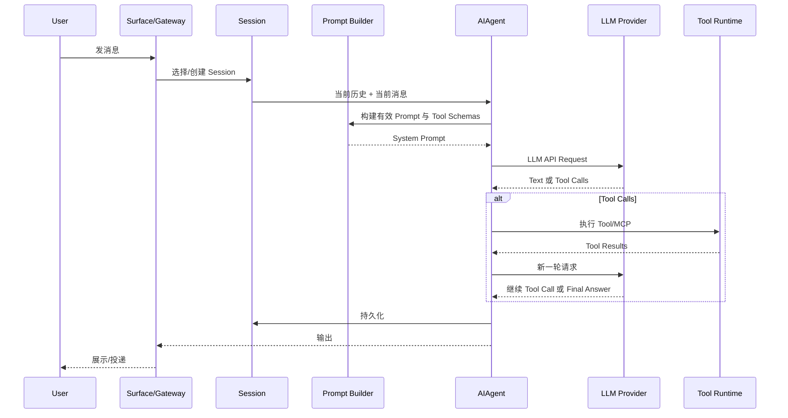
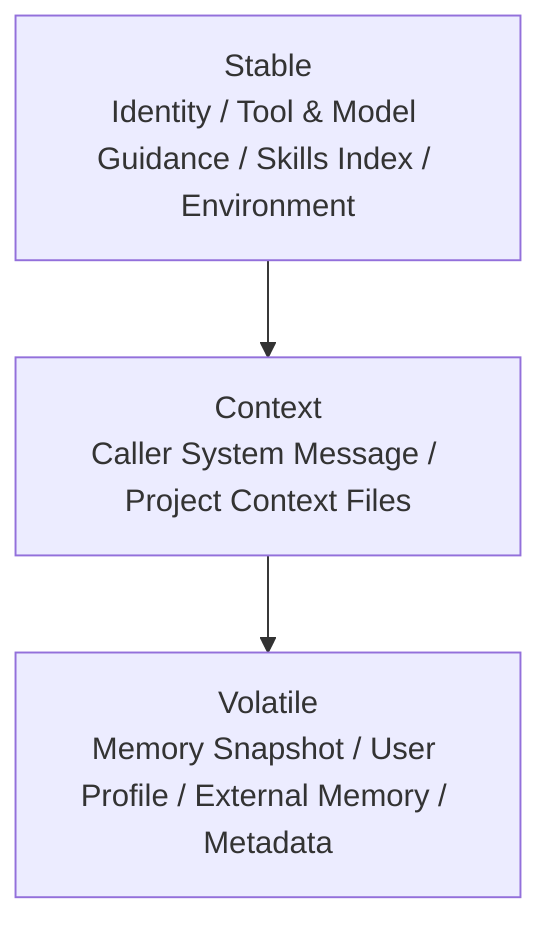
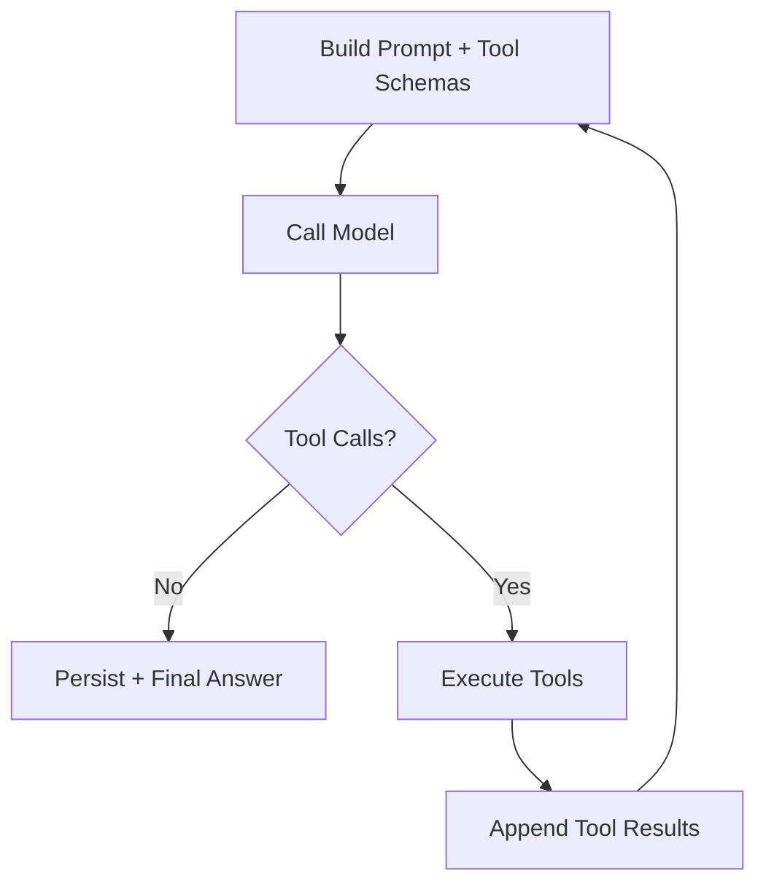
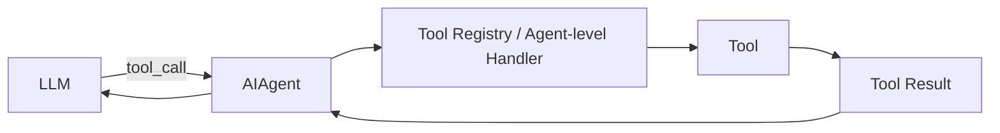
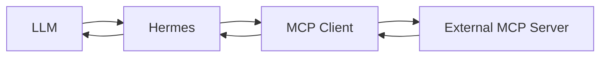
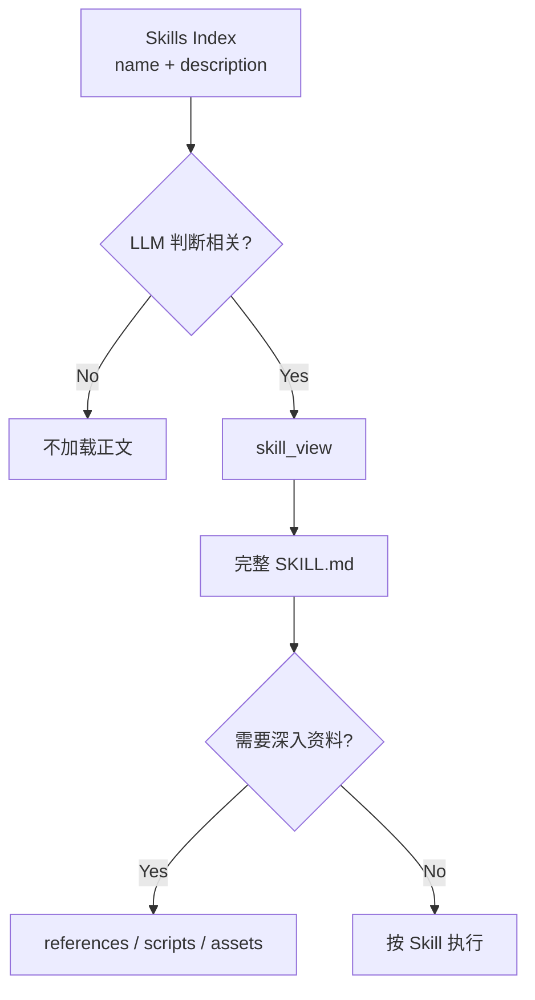
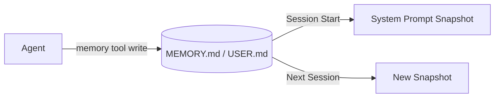
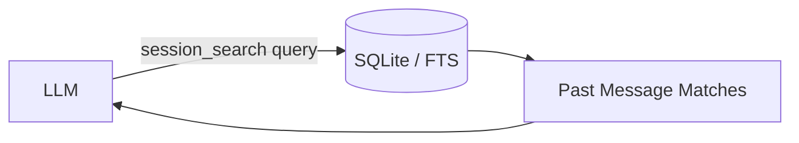
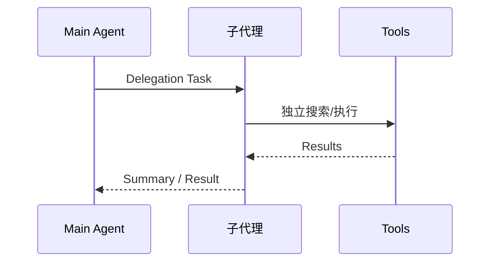
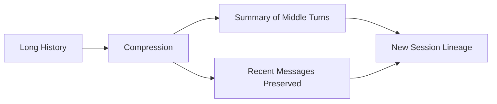

# 04 · Agent Loop 与 LLM 请求结构

> **目标**：理解“我给 Hermes 发一句话”之后，真正进入 LLM 的是什么，以及 Tool、MCP、Skill、Memory、Session Search 如何参与循环。

> **事实核验基线**：2026-07-21；术语规范见 [reference/terminology.md](./reference/terminology.md)。

## 1. 不是把用户原话直接转发给 LLM

逻辑上，一次请求更接近：

```text
LLM Request
├─ System Prompt
│  ├─ Identity / SOUL
│  ├─ Behavior Guidance
│  ├─ Skills Index
│  ├─ Environment / Platform Hints
│  ├─ Project Context
│  ├─ MEMORY / USER snapshot
│  └─ Session / Model / Provider metadata
│
├─ Conversation History
│  ├─ user
│  ├─ assistant
│  ├─ tool_call
│  └─ tool_result
│
├─ Current User Message
│  └─ 可能附带本轮 ephemeral context
│
└─ Tool Schemas
   ├─ terminal
   ├─ files
   ├─ memory
   ├─ session_search
   ├─ skill_view
   └─ 当前启用的其他工具
```

不同 Provider 的真实 JSON 格式会不同，但 Runtime 层的逻辑角色基本一致。

## 2. 一条消息的端到端路径



## 3. Cached System Prompt 的三层

当前官方 Prompt Assembly 文档把缓存 System Prompt 分成三个有序层：



### Stable

会话中最希望保持稳定的部分，例如：

- Agent Identity；
- Tool/Model Guidance；
- Skills 索引；
- 环境与平台提示。

### Context

当前工作环境，例如：

- 调用方额外传入的 System Message；
- `.hermes.md` / `HERMES.md`；
- `AGENTS.md`；
- `CLAUDE.md`；
- `.cursorrules`。

项目上下文的具体查找优先级属于实现细节，应以当前 Prompt Assembly 文档为准。

### Volatile

在 Session 建立时确定、但相对 Stable 更容易变化的内容，例如：

- `MEMORY.md` 快照；
- `USER.md` 快照；
- 外部 Memory Provider Block；
- 时间、Session、Model、Provider 信息。

注意：“Volatile”不等于“每轮都随意重建”。

## 4. Ephemeral API-call-time Context

Hermes 还区分缓存 System Prompt 和只在某次 API Call 生效的临时信息。

例如：

```text
[Ephemeral Context]
Current channel: Telegram
Relevant recall: ...
Plugin pre_llm_call context: ...

[User Message]
帮我回复 Alice
```

这种设计可以在不持续破坏缓存前缀的情况下，为当前 Turn 增加临时信息。

## 5. Tool Schemas 通常是独立字段

不要把 Tool 理解成 System Prompt 里的一大段说明。

逻辑上更像：

```json
{
  "system": "...",
  "messages": [],
  "tools": [
    {"name": "terminal", "schema": "..."},
    {"name": "session_search", "schema": "..."}
  ]
}
```

模型根据 Schema 产生结构化 Tool Call，Runtime 再执行。

## 6. Agent Loop

核心循环可以抽象为：



真正的实现还需要处理：

- Provider Resolution；
- Retry / Fallback；
- Interrupt；
- Iteration Budget；
- Concurrent Tool Execution；
- Context Compression；
- Session Persistence。

## 7. 普通 Tool



从模型角度看，重点是：

> **Action → Observation → Next Decision**

## 8. MCP Tool

MCP 只是把执行端放到了外部 Server。



对 LLM 来说，它仍然收到 Tool Result。

## 9. Skill

Skill 更接近“按需加载的程序性知识”。



这就是 Progressive Disclosure：

- 索引常驻；
- 正文按需；
- 更深参考再按需。

## 10. Memory

内置 Memory 在 Session 开始时进入 System Prompt 快照。

当前 Session 中发生的 Memory 写入会持久化到磁盘，但不意味着立即重建已经缓存的 System Prompt。



## 11. Session Search

历史 Session 不需要全部塞进 Prompt。

需要时：



这使“长期事实”和“历史经历”可以分开管理。

## 12. 子代理（Subagent）

当主 Agent 判断某个任务适合独立上下文时，可以通过 `delegate_task` 委派给子代理。子代理不会自动看到父会话历史；父 Agent 必须显式传递 `goal` 与 `context`。



子代理拥有独立上下文和 Terminal Session，只有最终摘要进入父 Agent 的上下文。

## 13. Prompt Caching 为什么是架构约束

长会话的系统成本不仅来自“这轮新写了多少字”，还来自每轮请求必须重新发送多少上下文。

稳定前缀有助于缓存复用。

因此 Hermes 会特别关心：

- System Prompt 是否稳定；
- Tool Schema 是否无意义变化；
- Memory 是否每轮强制重建；
- Context Compression 何时触发。

这也是为什么“把所有能力都变成永远启用的 Core Tool”并不是好设计。

## 14. Context Compression

上下文接近模型窗口上限时，Hermes 会压缩中间历史，同时保护近期消息和 Tool Call/Result 配对。

高层逻辑：



Compression 是少数会显著改变会话上下文结构的操作。

## 15. 最重要的统一视角

Hermes 很多能力最终都收敛到同一个循环：

```text
我需要做事
→ Tool

我需要外部系统
→ MCP Tool

我需要知道怎么做
→ Skill

我需要长期事实
→ Memory

我需要回忆过去
→ Session Search

我需要分工
→ 子代理 / Kanban

Observation
→ LLM decides next action
```

下一篇：

→ [05-memory-skills-and-self-improvement.md](./05-memory-skills-and-self-improvement.md)

### 参考

- Prompt Assembly: `https://hermes-agent.nousresearch.com/docs/developer-guide/prompt-assembly`
- Agent Loop: `https://hermes-agent.nousresearch.com/docs/developer-guide/agent-loop`
- Architecture: `https://hermes-agent.nousresearch.com/docs/developer-guide/architecture`
