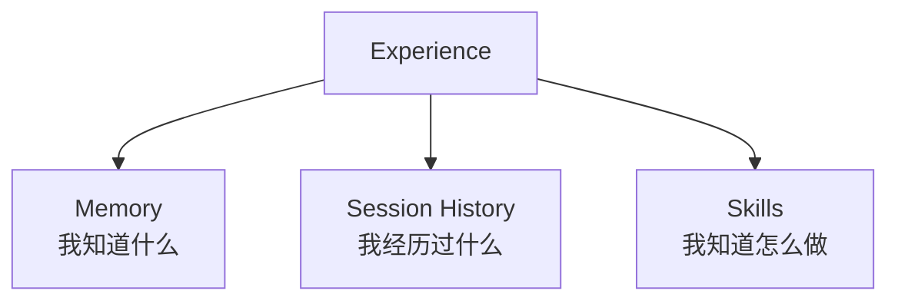
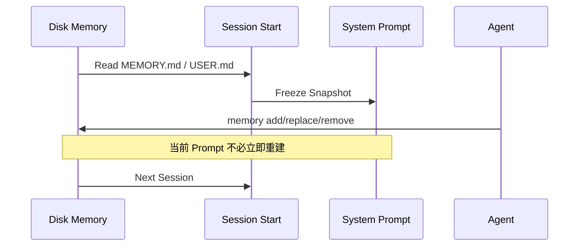
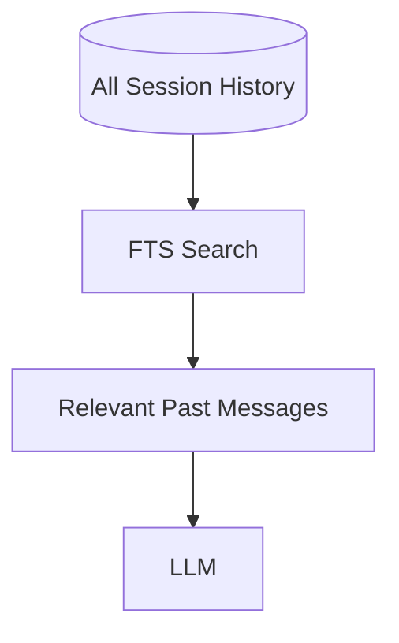
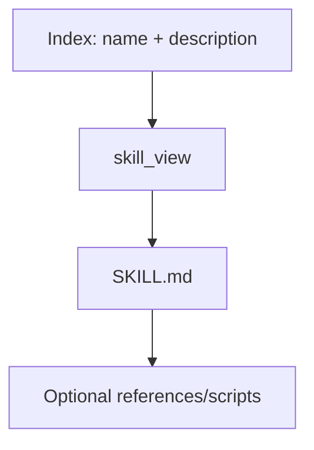
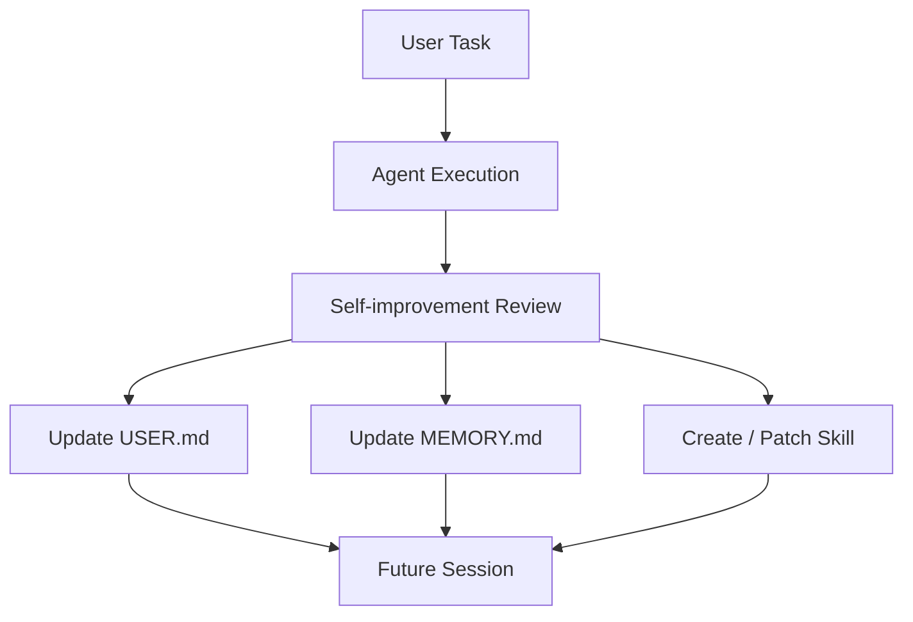
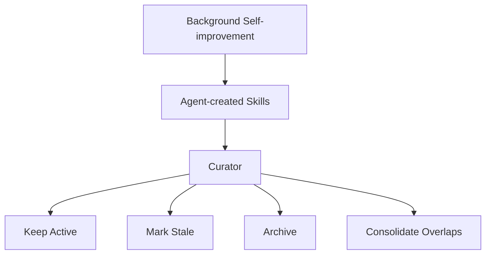
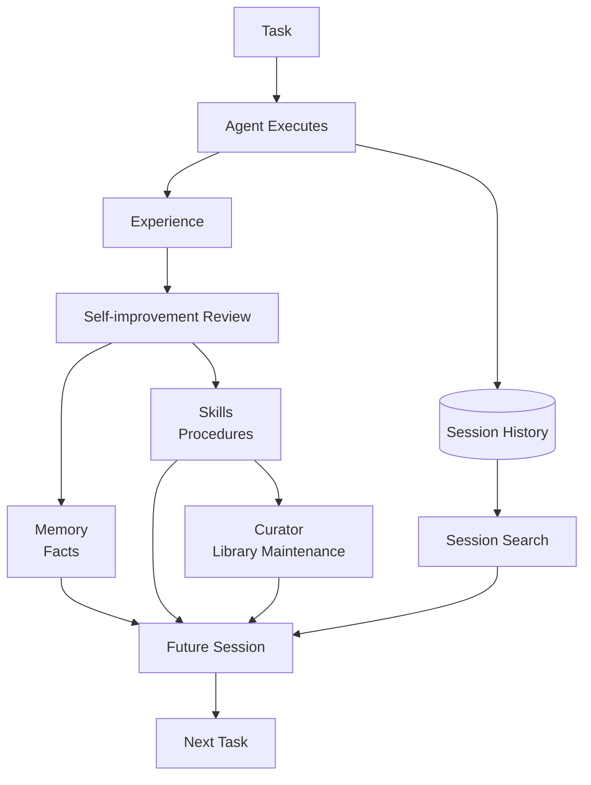
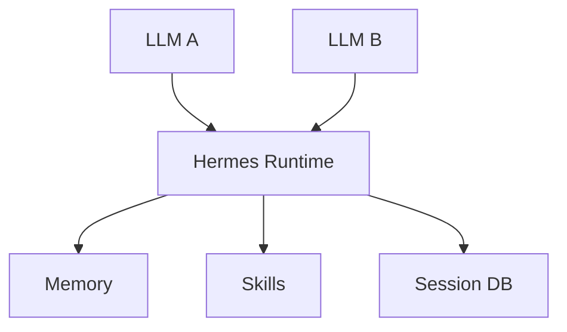

# 05 · 持久记忆、技能与自我改进

> **目标**：理解 Hermes 所谓“长期学习”和“自我进化”的真实机制。  
> 关键结论：**Hermes 在线进化的主要对象是外部持久状态，不是基础模型权重。**

> **事实核验基线**：2026-07-21；术语规范见 [reference/terminology.md](./reference/terminology.md)。

## 1. 三种长期知识



这三者解决不同问题。

| | Memory | Session Search | Skill |
|---|---|---|---|
| 内容 | 长期事实、偏好、结论 | 原始历史 | 方法、SOP、经验 |
| 典型问题 | “用户喜欢什么？” | “之前到底讨论了什么？” | “下次应该怎么做？” |
| 加载方式 | Session 开始快照 | 按需搜索 | Progressive Disclosure |
| 是否持续演化 | 可修改 | 历史主要追加 | 可创建、Patch、重构 |

## 2. 内置 Memory

每个 Profile 的内置持久记忆主要由两个文件构成：

```text
$HERMES_HOME/
└── memories/
    ├── MEMORY.md
    └── USER.md
```

### MEMORY.md

适合保存：

- 项目长期约定；
- 环境事实；
- 稳定的工作习惯；
- 已确认的技术结论。

### USER.md

适合保存：

- 用户沟通偏好；
- 长期工作风格；
- 用户对 Agent 的稳定期待。

内置持久记忆被刻意限制为较小规模，目的是：

> **保持“常驻 Prompt 信息”高密度，而不是把所有历史都塞进长期记忆。**

## 3. Memory Snapshot

Memory 在 Session 开始时进入缓存 System Prompt。



这与 Prompt Caching 的设计目标一致。

## 4. Session Search

不是所有过去经历都应该被压缩进 Memory。



例子：

- “用户长期使用 uv” → Memory。
- “两周前为什么决定 RC 而不是 EP？” → Session Search。

因此 Hermes 的长期记忆更接近：

```text
Always-on curated memory
+
On-demand episodic recall
```

## 5. Skill 是程序性知识

Skill 保存：

> **“怎样完成某类任务。”**

典型结构：

```text
my-skill/
├── SKILL.md
├── references/
├── scripts/
├── templates/
└── assets/
```

Skill 可以描述：

- 什么时候使用；
- 执行顺序；
- 应调用什么 Tool；
- 失败条件；
- Verification；
- Pitfalls。

## 6. Progressive Disclosure

Skill 库可以很大，因为正文不是全部常驻。



这与 Memory 形成鲜明对比：

- Memory 小而常驻；
- Skill 大而按需。

## 7. Agent 如何修改 Skill

Agent 内部使用 Skill 管理能力创建或修改程序性知识。

高层动作通常包括：

```text
create
patch
edit
write_file
remove_file
delete
```

注意：

> 这是 Agent Tool Surface，不应和用户 Shell CLI `hermes skills` 混为一谈。

日常用户管理 Skill 使用：

```bash
hermes skills
```

## 8. 什么经验值得形成 Skill

比较典型的信号：

- 完成了一个多步骤复杂任务；
- 经历多次失败后找到可靠路径；
- 用户纠正了 Agent；
- 某个流程会重复出现；
- 存在明确的验证步骤和 Pitfalls。

反过来，下面内容更适合 Memory：

- 用户喜欢简洁回答；
- 项目统一使用 pnpm；
- 某台服务器的长期角色。

## 9. Self-improvement Review

Hermes 的 self-improvement 可以理解为任务后的后台复盘。



它回答：

```text
刚才有没有新的长期事实？
有没有用户偏好变化？
有没有值得沉淀的工作流？
有没有失败经验应该补进 Skill？
```

## 10. 人类监督模式

因为 Memory 和 Skill 都会影响未来 Agent 行为，它们本质上属于高影响持久状态。

因此生产环境中应认真考虑：

- 是否允许 Agent 自动写 Memory；
- 是否允许 Agent 自动改 Skill；
- 是否需要审批；
- 是否需要 Diff；
- 是否需要审计日志。

“Agent 会学习”并不天然等于“Agent 应该不受监督地修改自己的长期行为资产”。

## 11. Curator

Self-improvement 解决：

> **刚才学到了什么？**

Curator 解决：

> **由后台自我改进创建的技能，长期看还健康吗？**



这里有一个重要的事实边界：Curator **不是无差别整理所有 Skill**。

- 主要管理在 `.usage.json` 中明确标记为 `agent-created` 的 Skill；
- 手工创建、External Directory 中的 Skill，以及前台会话中按用户要求创建的 Skill，默认不在其自动管辖范围内；
- Hub-installed Skill 不会被 Curator 修改；
- Bundled Skill 只可能在允许 `prune_builtins` 时按闲置规则归档，不会被自动 Patch、Consolidate 或 Delete；
- Archive 可恢复，自动流程不会永久删除 Skill。

截至 2026-07-21，官方默认生命周期为：

```text
active → 30 天未使用 → stale → 90 天未使用 → archived
```

Pinned Skill 跳过自动状态迁移。执行真实修改前 Curator 会创建 Snapshot，并支持 Dry Run、Restore 与 Rollback。

## 12. Curator 与 Skill Supply Chain

Skill 的来源可能不同：

- Bundled；
- Hub-installed；
- Agent-created；
- 手工创建；
- External directories。

不同来源的信任等级不同。

Curator 的生命周期治理不能替代：

- Skill 安装前审计；
- Script 检查；
- 依赖检查；
- Secret 管理；
- Prompt Injection 防护。

## 13. 完整学习闭环



这就是 Hermes “自我进化”最准确的理解：

> **不是模型权重在线更新，而是 Runtime 的长期认知资产持续积累、检索、修正和治理。**

## 14. 为什么换模型后经验仍能保留



只要这些状态仍存在，新模型原则上仍可以使用它们。

## 15. 风险：持久化 Prompt Injection

Self-improvement 会引入一个重要安全问题：


因此 Memory/Skill 的写入审批和安全扫描，不是附属功能，而是长期 Agent 的核心安全边界。

下一篇：

→ [06-architecture.md](./06-architecture.md)

### 参考

- Memory: `https://hermes-agent.nousresearch.com/docs/user-guide/features/memory`
- Skills: `https://hermes-agent.nousresearch.com/docs/user-guide/features/skills`
- Curator: `https://hermes-agent.nousresearch.com/docs/user-guide/features/curator`
