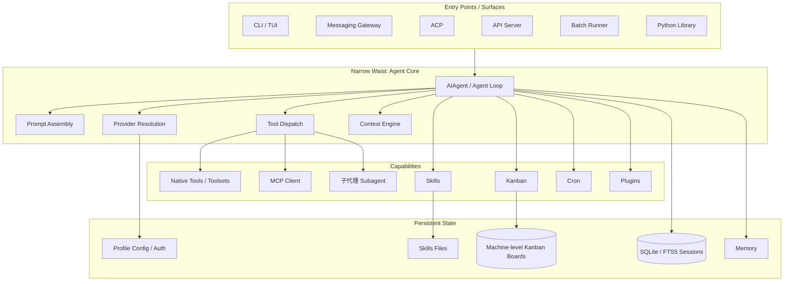
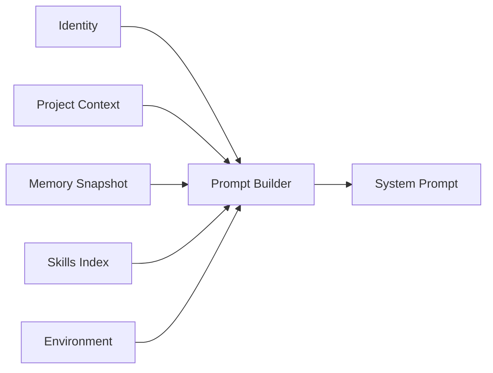
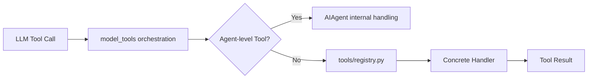
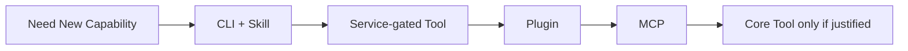
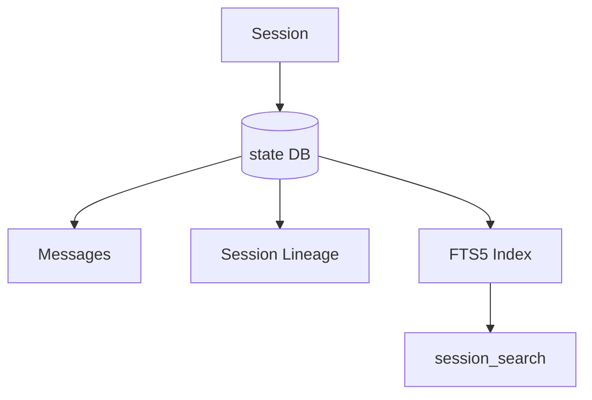
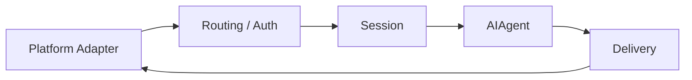
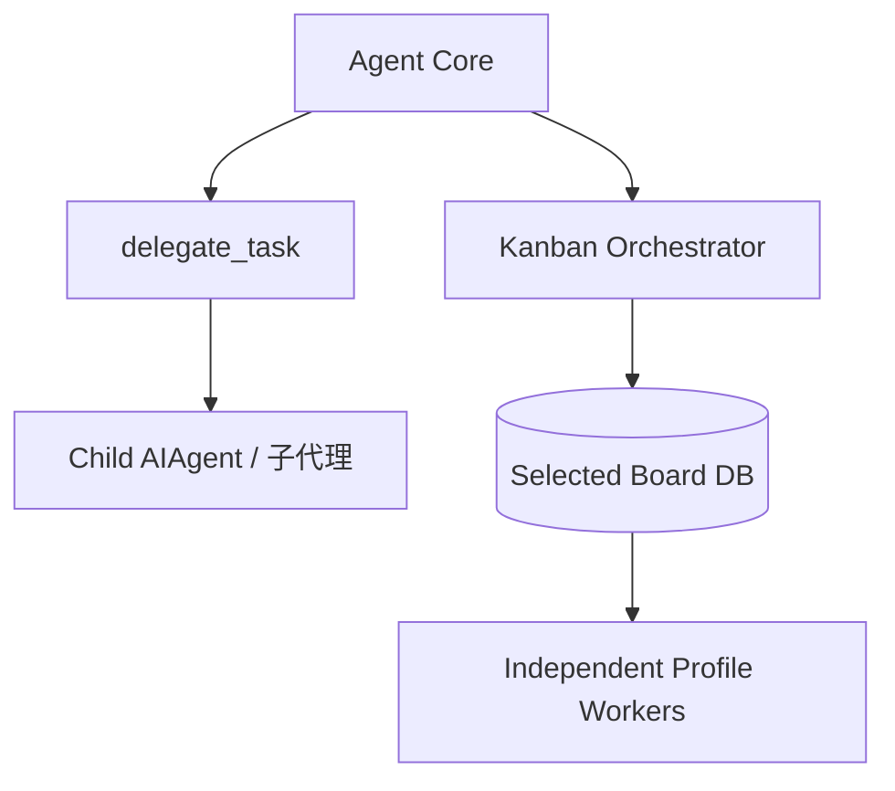

# 06 · Hermes Agent 软件架构

> **目标**：建立一个足够稳定、能映射到源码、但不过度依赖当前文件行号的架构模型。

> **事实核验基线**：2026-07-21；术语规范见 [reference/terminology.md](./reference/terminology.md)。

## 1. 顶层架构



## 2. Narrow Waist

Hermes 的核心思想之一是：

> **入口很多，但核心执行路径尽量统一。**

CLI、Gateway、ACP、Batch 和 API 不应该各自实现一套 Agent。

它们最终都把工作交给 Agent Core。

这带来两个好处：

1. 新 Surface 不需要复制 Agent 能力；
2. 核心行为更容易保持一致。

## 3. AIAgent

`run_agent.py` 中的 `AIAgent` 是核心同步编排引擎。

高层职责包括：

- Prompt 构建；
- Provider 选择；
- LLM 调用；
- Tool Dispatch；
- Retry / Fallback；
- Compression；
- Interrupt；
- Iteration Budget；
- Session Persistence。

不要把它理解成“一个调用模型的函数”，它更接近一轮 Agent 生命周期的中央编排器。

## 4. Prompt System

Prompt System 主要解决：

> **模型这一轮应该看到什么？**

关键模块包括：

- `agent/prompt_builder.py`
- System Prompt 分层模块；
- Prompt Caching；
- Context Compressor；
- Context Engine 插件接口。



## 5. Provider Runtime Resolution

Hermes 需要面对不同 API 风格和认证方式。

因此 Provider 层负责把：

```text
(provider, model, credentials)
```

解析为实际运行所需的：

```text
api_mode
api_key / OAuth credential
base_url
adapter behavior
```

核心价值不是“支持多少个 Provider”，而是：

> **让 Agent Loop 不需要为每个模型服务商重新实现一套控制流。**

## 6. Tool Runtime



一部分能力与 Agent 生命周期紧密耦合，因此可能由主循环直接处理；其他能力通过中央 Registry Dispatch。

Toolset 则负责把多个 Tool 组织成可启用的 Surface。

## 7. 为什么 Core Tool 不能无限增长

每一个长期暴露给模型的 Tool 都会增加：

- Schema Token；
- Tool Selection 难度；
- Prompt 缓存压力；
- 安全攻击面。

因此新的能力应优先考虑：



这不是严格的强制顺序，而是很有价值的架构决策梯度。

## 8. Plugin System

Plugin 是把能力放到核心之外的重要机制。

典型扩展包括：

- Tools；
- Hooks；
- CLI Commands；
- Memory Provider；
- Context Engine；
- Model Provider；
- Platform Adapter。

Plugin 的价值在于：

> **扩展能力，而不必持续扩大核心 Agent Loop。**

## 9. Session Persistence

Hermes 使用 SQLite 保存 Session，并使用 FTS5 做全文检索。



Compression 可能形成新的 Session lineage，因此“Session”不是单纯的一张文本日志。

## 10. Profile 与 `$HERMES_HOME`

官方定义是：

> **每个 Profile 都对应一个独立的 `$HERMES_HOME`。**

默认 Profile 通常使用：

```text
~/.hermes/
```

命名 Profile 通常使用：

```text
~/.hermes/profiles/<name>/
```

配置、凭证、SOUL、持久记忆、会话、技能、Cron 与 Profile State 都跟随该 `$HERMES_HOME`。因此技能的准确路径表达应是：

```text
$HERMES_HOME/skills/
```

而不是把默认 Profile 的 `~/.hermes/skills/` 理解成所有 Profile 自动共享的全局目录。跨 Profile 复用 Skill 应使用 Clone、分发或 External Skill Directories 等显式机制。

Kanban 是一个例外：它是跨 Profile 协作所需的**机器级共享状态**。默认 Board 使用 `~/.hermes/kanban.db`；其他 Board 使用 `~/.hermes/kanban/boards/<slug>/kanban.db`。

## 11. Gateway 为什么不属于 Agent Core

Gateway 负责长期连接与消息生命周期，而不是核心推理。



Gateway 可以做：

- Allowlist；
- DM Pairing；
- Slash Commands；
- Streaming；
- Delivery；
- Cron Ticking；
- Background Maintenance。

这些都属于 Runtime 的外围长期生命周期。

## 12. 子代理与 Kanban 在架构中的位置

子代理属于 Agent Core 的临时执行扩展；Kanban 属于机器级、持久化的多 Profile 协调层。



两者不可互换：子代理强调隔离上下文和结果回传；Kanban 强调 Durable Task、依赖、Dispatcher 与跨进程恢复。

## 13. 状态权威

架构设计应先问：

> **谁拥有这块状态的权威？**

例如：

- Session 真相在后端持久层；
- Renderer 只是 UI 视图；
- 临时展开状态留在组件；
- Profile 配置属于对应 `$HERMES_HOME`；
- Kanban Task 属于当前选定的机器级 Board DB。

这比“哪里最方便存”更重要。

## 14. Stable Architecture vs Source Snapshot

长期 Wiki 应避免：

- `gateway/run.py 有 22,984 行`；
- `AIAgent 在第 321 行`；
- “恰好有 70 个工具”；
- “恰好有 20 个平台”。

更好的引用方式：

```text
Hermes commit: <sha>
Module: run_agent.py
Symbol: AIAgent.run_conversation
```

这样重构后仍然容易定位。

## 15. 推荐源码入口

优先：

1. `website/docs/developer-guide/architecture.md`
2. `website/docs/developer-guide/agent-loop.md`
3. `website/docs/developer-guide/prompt-assembly.md`
4. `run_agent.py`
5. `agent/prompt_builder.py`
6. `model_tools.py`
7. `tools/registry.py`
8. Session Storage 文档
9. Gateway Internals
10. Kanban / Curator / Security 专题

不要一开始就试图从巨型 `gateway/run.py` 顺序读到尾。

下一篇：

→ [07-automation-and-orchestration.md](./07-automation-and-orchestration.md)

### 参考

- Architecture: `https://hermes-agent.nousresearch.com/docs/developer-guide/architecture`
- Agent Loop: `https://hermes-agent.nousresearch.com/docs/developer-guide/agent-loop`
- Prompt Assembly: `https://hermes-agent.nousresearch.com/docs/developer-guide/prompt-assembly`
- Profiles: `https://hermes-agent.nousresearch.com/docs/user-guide/profiles`
