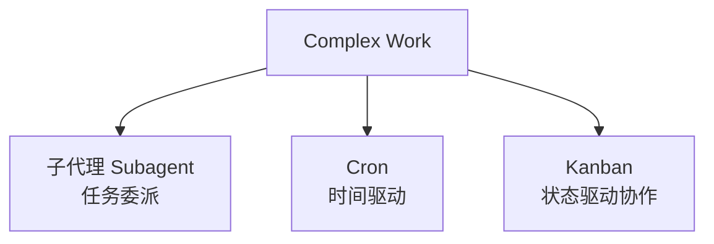
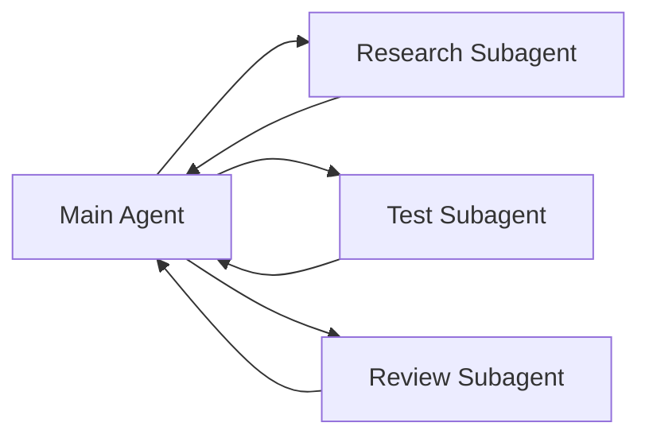
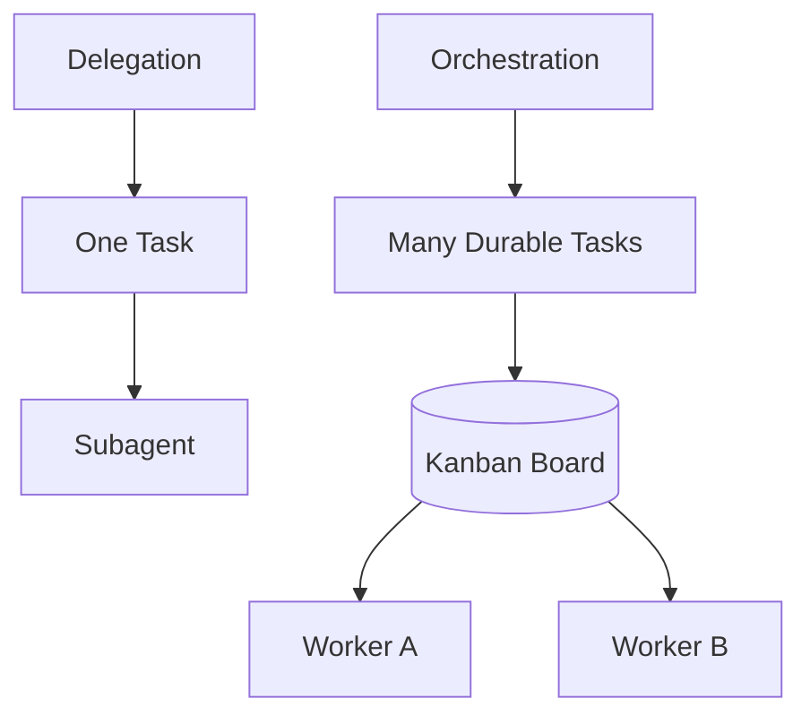
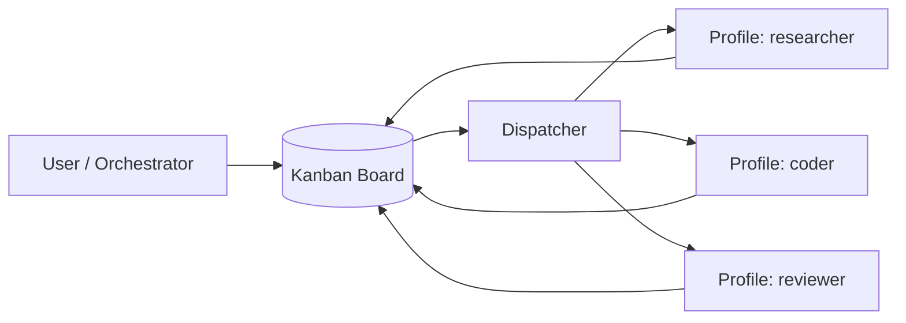
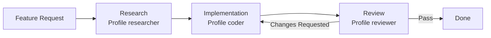
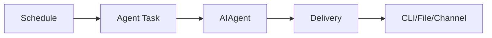
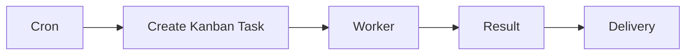

# 07 · 自动化与多代理编排

> **目标**：区分子代理（Subagent）、Cron 和 Kanban，并理解 Hermes 如何从单 Agent 扩展到长期工作流。

> **事实核验基线**：2026-07-21；术语规范见 [reference/terminology.md](./reference/terminology.md)。

## 1. 三种机制解决三种问题



一句话：

- **子代理（Subagent）**：这件事交给另一个上下文做。
- **Cron**：这件事到时间自动做。
- **Kanban**：这批工作由多个长期 Worker 持续推进。

## 2. 子代理（Subagent）

子代理适合一次性、边界清楚的独立任务。



价值：

- 主上下文不被大量中间资料污染；
- 可以并行；
- 可以给不同任务分配不同预算或能力；
- 主 Agent 只接收结果摘要。

### 适合

- 分析三个独立 PR；
- 并行研究三种方案；
- 让独立 Agent 跑大量只读搜索；
- 把长日志分析隔离出去。

### 不适合

- 任务之间有复杂长期依赖；
- 需要跨进程恢复；
- 需要持续可视化任务状态；
- Worker 之间需要长期协调。

这时进入 Kanban。

## 3. 从 Delegation 到 Orchestration



子代理更像一次隔离执行调用。

Kanban 更像持久化协作系统。

## 4. Hermes Kanban 协作看板

当前 Hermes Kanban 的核心定位是：

> **跨多个 Hermes Profile 共享的持久化多代理协作看板。**

任务被存入数据库，而不是只存在主 Agent 当前进程内。

Worker 是完整的 OS 进程，并以分配给自己的 Profile 运行。当前版本支持多个独立 Board：默认 Board 位于 `~/.hermes/kanban.db`，其他 Board 位于 `~/.hermes/kanban/boards/<slug>/kanban.db`。每个任务只属于一个 Board，Worker 运行时会被固定到目标 Board。



## 5. 为什么 Kanban 比“多开几个子代理”更持久

Kanban 具有：

- Durable Tasks；
- Comments；
- Links / Dependencies；
- Blocking / Unblocking；
- Worker Heartbeat；
- Completion State；
- 多 Board；
- 多 Profile 路由。

因此它适合：

```text
任务运行几小时甚至几天
Worker 可能重启
任务需要人工观察
不同角色分阶段接力
任务之间有依赖
```

## 6. 一个角色流水线



这已经不是简单的并行 Tool Call，而是一个有状态工作流。

## 7. Kanban 的两个 Surface

用户或脚本通过 CLI 操作 Board。

Agent Worker 则通过专门的 `kanban_*` Toolset 读写任务。

这是一种重要分层：

> **人类用 CLI 管 Board；Agent 用结构化 Tool 管 Board。**

不要让 Worker 为了改任务状态去 Shell 调 `hermes kanban`。

## 8. Cron

Cron 解决的是时间触发。



Hermes Cron 的核心价值在于它调度的是 Agent Task，而不是只执行一个 Shell 命令。

适合：

- 日报；
- 周报；
- 定期仓库检查；
- 定时研究；
- 定时提醒；
- 定期安全审计。

## 9. Cron 与 Kanban 可以组合



例如：

> 每周一 9 点创建一次“审查所有活跃仓库”的 Kanban Epic，由 researcher/coder/reviewer 三个 Profile 分工。

Cron 提供时间触发；Kanban 提供状态协调。

## 10. 子代理、Cron、Kanban 对比

| | 子代理（Subagent） | Cron | Kanban |
|---|---|---|---|
| 主要触发 | 主 Agent | 时间 | Board / Dispatcher |
| 生命周期 | 一次任务 | 周期或一次调度 | 长期持久化 |
| 状态 | 主要在当前执行链 | Job State | Durable Task DB |
| 多 Worker | 可并行 | 不是重点 | 核心能力 |
| 依赖关系 | 弱 | 弱 | 强 |
| 最适合 | 独立子任务 | 定时任务 | 多阶段协作 |

## 11. 实际使用建议

### 先用子代理

如果任务只需要：

> “帮我并行调查 A/B/C，然后汇总。”

不要一上来上 Kanban。

### 再用 Kanban

当你开始遇到：

```text
任务要恢复
任务要排队
任务要分配角色
任务要依赖
任务要审计
```

再使用 Kanban。

### Cron 不负责替代工作流引擎

Cron 只决定“什么时候触发”。复杂任务状态仍应放在更适合的系统里。

## 12. 安全提醒

多代理 会放大权限问题。

需要明确：

- Worker 拥有哪些 Tool；
- Profile 能访问哪些文件；
- 是否使用 Worktree；
- 是否能写 Memory/Skill；
- 是否能触发其他任务；
- Board 是否暴露在网络上。

下一篇：

→ [08-gateway-and-integrations.md](./08-gateway-and-integrations.md)

### 参考

- Kanban: `https://hermes-agent.nousresearch.com/docs/user-guide/features/kanban`
- Cron / Architecture: `https://hermes-agent.nousresearch.com/docs/developer-guide/architecture`
