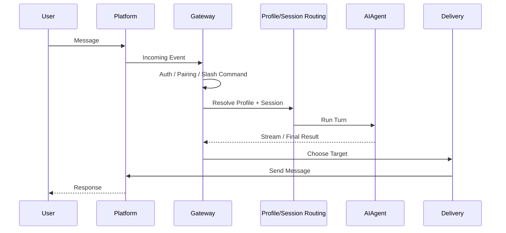
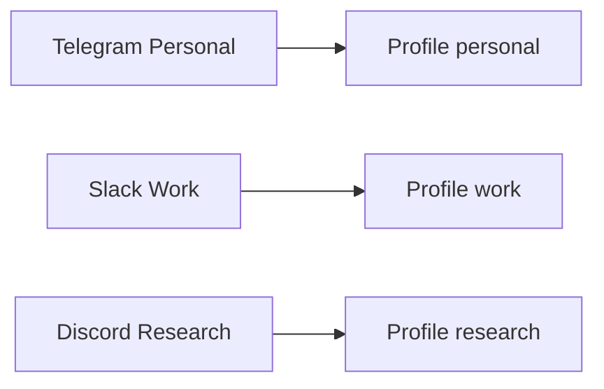
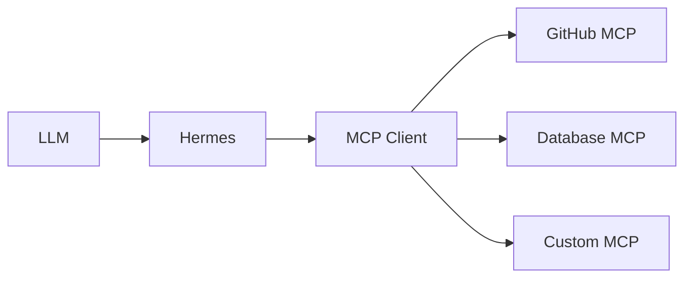
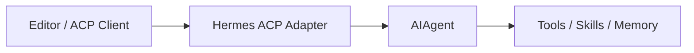
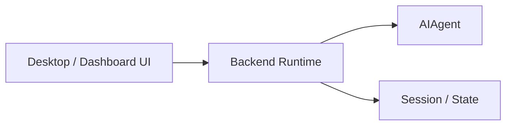

# 08 · 消息网关与外部集成

> **目标**：理解 Hermes 如何成为一个长期运行、可从不同消息平台访问的 Agent Runtime。

## 1. 先区分四个概念

### Surface

用户看到的交互界面。

例如：

- CLI；
- TUI；
- Desktop；
- Dashboard。

### Platform Adapter

适配 Telegram、Discord、Slack 等外部平台的代码。

### Channel / Chat

具体的平台会话目标。

例如某个 Telegram Chat 或 Discord Channel。

### Gateway

长期运行、管理 Adapter 生命周期、路由 Session、执行 Agent 并投递结果的 Runtime 进程。

不要把“我有五个 Chat”写成“我有五个 Gateway”。

## 2. Gateway 数据流



## 3. 为什么 Gateway 是长期进程

消息平台连接需要：

- 长连接；
- Polling；
- 重连；
- 用户授权；
- Session 路由；
- 后台任务；
- Cron Tick；
- Delivery。

这些都不是一次 CLI 调用可以自然承担的。

## 4. Profile Routing

Gateway 可以根据来源把请求路由到不同 Profile。

概念上：



具体匹配字段和优先级可能随版本演进，应以当前 Profile/Gateway 文档为准。

## 5. Session Routing

Gateway 需要决定：

- 继续哪个 Session；
- 是否创建新 Session；
- Thread 是否继承父 Channel；
- 当前是否已有运行中的 Agent；
- 新消息是 Interrupt、Queue 还是新 Turn。

这就是为什么 Gateway 比“一个 Telegram Bot 回调函数”复杂得多。

## 6. Delivery

Agent 运行结果可以回到：

- 原始消息来源；
- 显式目标；
- 平台 Home Channel；
- 本地文件或其他 Delivery Target。

Cron 也可以复用 Delivery，把后台任务输出推送到 Channel。

## 7. 用户授权

长期 Agent 一旦接入消息平台，最大的风险是：

> **谁可以让它执行工具？**

至少应考虑：

- Allowlist；
- DM Pairing；
- 群聊 Mention Requirement；
- 危险 Tool Approval；
- 不同 Channel 的 Toolset；
- Webhook 最小权限。

详细见 [09-security.md](./09-security.md)。

## 8. MCP Client

Hermes 作为 MCP Client 时：



外部 MCP Tool 会被整合到 Agent 可用 Tool Surface。

## 9. Hermes 作为 MCP Server

Hermes 也可以运行：

```bash
hermes mcp serve
```

它以 stdio MCP Server 的形式暴露 Hermes 的消息会话 Bridge，包括列出会话、读取历史、发送文本消息、轮询事件和处理审批等能力。

正确的比较不是：

> “Hermes 是唯一能做 MCP Server 的 Agent。”

Claude Code 当前也支持 `claude mcp serve`，但它主要暴露 Claude Code 自身的文件/编辑等工具；Hermes 的差异在于其 MCP Surface 围绕长期 Gateway 与跨平台消息会话。当前 Hermes Bridge 的发送能力仍有边界，例如 `messages_send` 是文本发送，且发送操作需要对应 Gateway/平台连接正在运行。

## 10. ACP

ACP 让编辑器或 Agent Client 把 Hermes 当作一个 Agent Server。



ACP 与 MCP 的层级不同：

```text
MCP: Agent ↔ Tool
ACP: Client ↔ Agent
```

## 11. Desktop、Dashboard 与 Backend

应该保持这样的概念边界：



Renderer 不应成为 Agent 行为的权威来源。

## 12. 运行模式

### 前台调试

```bash
hermes gateway run
```

### 后台服务

```bash
hermes gateway start
hermes gateway status
```

### Docker

```bash
docker run -d \
  --name hermes \
  --restart unless-stopped \
  -v ~/.hermes:/opt/data \
  nousresearch/hermes-agent gateway run
```

## 13. 对外暴露时必须谨慎

Dashboard、API、Plugin Route、Kanban Surface 等一旦绑定非 Loopback 地址，就必须重新审视：

- Authentication；
- TLS；
- Firewall；
- Reverse Proxy；
- API Key；
- Network Segmentation。

“默认只监听 localhost”不是永久安全保证。

## 14. 长期运维

建议关注：

```text
hermes status
hermes doctor
hermes logs
hermes gateway status
```

生产环境还应有：

- 日志轮转；
- 崩溃恢复；
- 进程监督；
- 资源限制；
- Backup；
- Secret Rotation。

下一篇：

→ [09-security.md](./09-security.md)

### 参考

- Gateway Internals: `https://hermes-agent.nousresearch.com/docs/developer-guide/gateway-internals`
- Profiles: `https://hermes-agent.nousresearch.com/docs/user-guide/profiles`
- MCP: `https://hermes-agent.nousresearch.com/docs/user-guide/features/mcp`
- ACP: `https://hermes-agent.nousresearch.com/docs/developer-guide/acp-internals`
