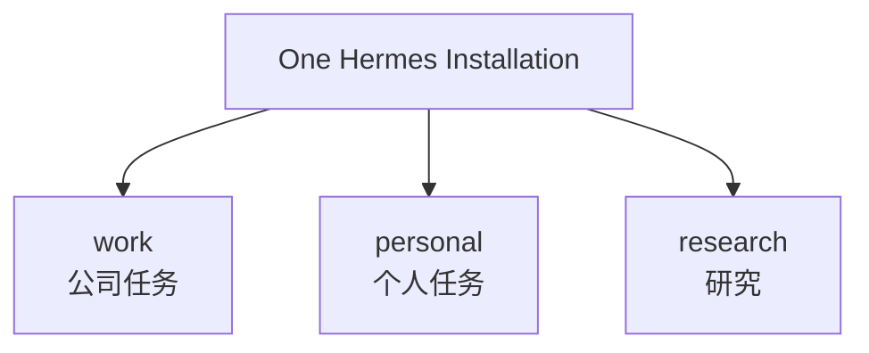
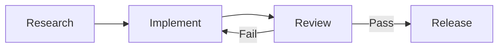
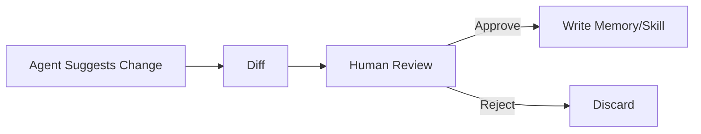

# 10 · 个人使用经验与实践建议

> **性质**：本篇主要是作者经验，不是官方规范。  
> **原则**：保留真实使用价值，但避免把个人选择写成普遍真理。

> **事实核验基线**：2026-07-21；术语规范见 [reference/terminology.md](./reference/terminology.md)。

## 1. 我把 Hermes 用在什么地方

高频场景包括：

- Coding 与代码库研究；
- GitHub 工作流；
- 长文研究与笔记；
- Session Search 回溯旧讨论；
- Skills 沉淀重复 SOP；
- Telegram 等远程入口；
- Cron 日报/周报；
- 子代理（Subagent）并行工作；
- 多 Profile 分离不同工作场景；
- 长期 Fork 维护。

Hermes 的价值通常不是“某一个 Tool 特别强”，而是这些能力可以围绕同一个 Runtime 组合。

## 2. 工作流一：Profile 分离角色

例如：



建议把 Profile 理解成：

> **独立 Agent Home。**

不同 Profile 可以使用不同：

- Model；
- Credentials；
- Memory；
- Skills；
- Cron；
- Gateway。

### 经验修正

如果采用多个独立 Gateway 进程，确实要避免端口和 Service Label 冲突。

但这只是某一种部署方式，不应该写成：

> “每个 Profile 永远必须独立 Gateway Port。”

Hermes 的多 Profile 与 Multiplex 行为应以当前版本为准。

## 3. 工作流二：Session Search 代替“把所有东西写进 Memory”

早期很容易过度使用 Memory。

更好的习惯是：

```text
长期稳定事实
→ Memory

偶尔需要回忆的历史细节
→ Session Search
```

例如：

> “用户偏好先讨论架构再实现。”

适合 Memory。

> “三周前那次 CANN/NUMA 讨论的完整理由。”

适合 Session Search。

## 4. 工作流三：把反复 SOP 变成 Skill

一个流程只有真正重复时，Skill 才会体现价值。

推荐 Skill 包含：

```text
When to Use
Procedure
Verification
Pitfalls
References
```

其中我最看重的是：

> **Pitfalls。**

因为真正可复用的经验往往不是“成功步骤”，而是：

> 哪些看起来合理的做法其实会失败。

## 5. 工作流四：用子代理保持主上下文干净

特别适合：

```text
A: 研究方案
B: 跑测试
C: Review Diff
```

三个任务可以各自读大量文件，主 Agent 最后只接收摘要。

这比把所有中间输出塞进一个主 Session 更容易控制上下文。

## 6. 工作流五：Kanban 处理长期协作

当任务从：

> “并行做三个调查”

升级成：

> “研究 → 实现 → Review → 修改 → Release”

就更适合持久化 Kanban。



每个阶段可以由不同 Profile Worker 承担。

## 7. 工作流六：Cron 做无人值守输出

典型任务：

- 每日 Session 总结；
- 每周 GitHub 状态；
- 定期项目 Health Check；
- 研究简报。

经验上，Cron 最重要的不是“能自动跑”，而是：

- 失败能不能被发现；
- 输出投递到哪里；
- 权限是否最小；
- 是否会无限重试；
- 是否会消耗异常 Token。

## 8. 关于 Model Fallback

Fallback 是可靠性工具，不只是省钱工具。

当主 Provider：

- Rate Limit；
- 认证失效；
- 服务故障；

Fallback 可以让长期任务继续运行。

但不要盲目堆模型链。

模型行为不同，切换后可能产生：

- Tool Calling 差异；
- Context Length 差异；
- 输出风格变化；
- 成本变化。

## 9. 关于 MOA

我的建议是：

> 高价值、难决策任务再考虑多模型聚合。

日常 CRUD、简单 Coding、Commit Message 通常不值得增加复杂度和成本。

这是个人成本策略，不是 Hermes 官方硬规则。

## 10. 关于 Secret

不要让 Agent 通过“读取整个 `.env`”来判断凭证是否有效。

更好的方式是：

```text
Credential Layer
→ status / connectivity probe
→ 只返回 configured / invalid / expired
```

尽量避免 Secret 原文进入模型上下文。

## 11. 关于 Self-improvement

建议先从“人工监督模式”使用。



当你对 Agent 的行为和 Skill 库质量建立信任后，再决定是否放宽自动写入。

## 12. 关于 Curator

Skill 越多，目录越可能出现：

- 重复；
- 过时；
- 范围过窄；
- 长期不用。

Curator 的价值是让“会学习”不会退化成“只会积累垃圾”。

建议定期查看：

```bash
hermes curator status
```

在真正修改前先使用 Dry Run（具体参数以当前 CLI 为准）。

## 13. 我的使用哲学

我现在更愿意把 Hermes 理解成：

> **一个可以长期维护的 Agent Runtime，而不是一次对话里的超级模型。**

真正值得长期投资的是：

- Skill Library；
- Memory Quality；
- Session History；
- Security Policy；
- Profile Design；
- Automation Reliability。

这些资产比“今天默认模型是什么”更耐久。

## 14. 给新用户的顺序建议

```text
1. 先跑通基础 Chat
2. 学会看 Tool Call
3. 理解 Profile / Session
4. 再用 Skills
5. 再开 Gateway
6. 再做 Cron
7. 再做子代理（Subagent）
8. 最后上 Kanban / Self-improvement Automation
```

复杂度应该逐层增加。
