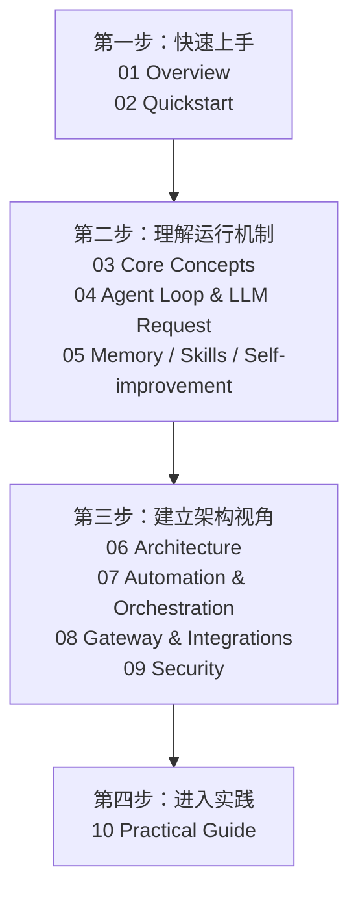
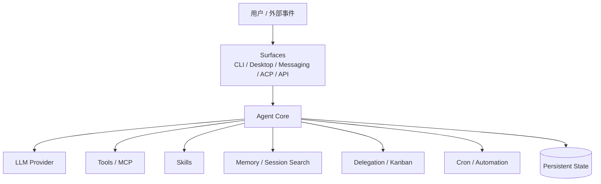

# Hermes Agent Wiki

> 面向希望**快速了解、实际跑起来，并进一步理解 Hermes Agent 软件架构**的读者。  
> 本 Wiki 不是 Hermes 官方文档，而是一套基于官方文档、官方源码、实际使用经验与专题研究整理的学习材料。
>
> **事实核验基线：2026-07-21**  
> Hermes 仍在快速演进；涉及 CLI、配置字段、Provider、平台数量和源码位置的内容，应以当前官方文档与所使用的 commit 为准。
>
> **仓库定位**：这是独立维护的社区技术知识库，不属于 Nous Research 官方仓库，也不是 `qixiaoz/hermes-agent` Fork 的组成部分。

## 这套 Wiki 解决什么问题

Hermes Agent 的资料很丰富，但新人容易遇到三个问题：

1. **功能很多，却不知道应该先理解什么。**
2. **会使用 CLI，却不知道一条消息进入 Hermes 后内部发生了什么。**
3. **看到持久记忆（Memory）、技能（Skill）、会话搜索（Session Search）、子代理（Subagent）、Kanban、Cron、Gateway 等概念，却缺少一张统一的架构地图。**

这套 Wiki 按“先使用，再理解运行机制，最后进入源码”的顺序组织内容。

## 文档导航

| 文档 | 你会得到什么 |
|---|---|
| [01-overview.md](./01-overview.md) | 知道 Hermes 是什么、适合谁，以及它在 Agent 软件生态中的位置 |
| [02-quickstart.md](./02-quickstart.md) | 安装 Hermes，完成首次配置、第一次对话和第一次 Tool Call |
| [03-core-concepts.md](./03-core-concepts.md) | 理清 Profile、Session、Agent、Tool、Skill、Memory、Gateway、Subagent、Kanban 等核心术语 |
| [04-agent-loop-and-llm-request.md](./04-agent-loop-and-llm-request.md) | 理解一条消息如何被组装成 LLM 请求，以及 Tool/MCP/Skill 如何回到 Agent Loop |
| [05-memory-skills-and-self-improvement.md](./05-memory-skills-and-self-improvement.md) | 理解 Hermes 如何“记住”“学会”“整理”——Memory、Session Search、Skills、Self-improvement、Curator |
| [06-architecture.md](./06-architecture.md) | 建立 Hermes 的软件架构心智模型，理解 Narrow Waist、Provider、Tools、Plugins、State |
| [07-automation-and-orchestration.md](./07-automation-and-orchestration.md) | 理解 Subagent、Cron、Kanban 与 Worker 分别解决什么问题 |
| [08-gateway-and-integrations.md](./08-gateway-and-integrations.md) | 理解 Gateway、Channel、消息路由、MCP、ACP、Dashboard 等外部集成 |
| [09-security.md](./09-security.md) | 理解 Profile 为什么不是 Sandbox，以及高权限 Agent 的主要信任边界 |
| [10-practical-guide.md](./10-practical-guide.md) | 一名重度用户的实际工作流、踩坑经验和使用建议 |
| [appendix/11-ecosystem-comparison.md](./appendix/11-ecosystem-comparison.md) | 从架构和集成深度比较 Hermes、Claude Code、OpenCode、OpenClaw |
| [reference/cli-and-configuration.md](./reference/cli-and-configuration.md) | 易漂移的 CLI 与配置速查 |
| [reference/source-code-map.md](./reference/source-code-map.md) | 源码学习地图与推荐阅读顺序 |
| [reference/terminology.md](./reference/terminology.md) | 全 Wiki 统一采用的中英文术语与书写规则 |
| [FACT-CHECK-CHANGELOG.md](./FACT-CHECK-CHANGELOG.md) | 本轮事实核验的修正记录、依据与仍需定期复查的项目 |

## 推荐阅读路径

### 完全新手

`01 → 02 → 03 → 04 → 05`

读完后，你应该已经能回答：

- Hermes 和普通 Chatbot 有什么不同？
- Profile、Session、Skill、Memory 分别是什么？
- 我发给 Hermes 的一句话，实际怎样进入 LLM？
- Tool Call 为什么能形成循环？
- Hermes 所谓“自我进化”到底进化了什么？

### 已经用过 Claude Code / OpenCode

`01 → 03 → 04 → 06 → 07 → Appendix 11`

重点不是再学一次“Agent 会调工具”，而是理解 Hermes 为什么更偏向**长期运行的 Agent Runtime**。

### 准备读源码

`03 → 04 → 06 → reference/source-code-map.md`

先抓控制流和数据流，再进入 `run_agent.py`、Prompt System、Tool Registry、Session Storage 和 Gateway。

## 术语与事实核验约定

本 Wiki 以 Hermes 官方当前用词为主：官方写作 **Subagent**（无连字符），中文正文统一称“子代理”；每个 Profile 是独立的 `$HERMES_HOME`；Kanban 是跨 Profile 的持久化协作看板，且当前版本支持多个 Board。完整规则见 [reference/terminology.md](./reference/terminology.md)。

版本相关事实优先引用官方文档；源码事实应绑定 commit SHA、模块路径和 Symbol，而不是长期引用行号。

## 事实等级

为了避免把个人经验写成“官方机制”，本 Wiki 使用下面四类信息：

- **官方事实**：来自 Hermes 官方文档或公开 API/CLI Reference。
- **源码事实**：来自特定 commit 的实现；可能随重构变化。
- **作者实测**：真实使用中观察到的现象，但不保证所有版本一致。
- **作者建议**：经验性做法，不代表 Hermes 的唯一正确用法。

涉及竞品时，尽量使用各自官方文档，并注明比较基线日期。

## 核心心智模型

Hermes 可以先被理解为：

> **一个长期运行、可替换模型、可调用工具、可积累外部状态，并能从多个入口持续工作的 Agent Runtime。**

## 主要来源

- Hermes 官方文档：`https://hermes-agent.nousresearch.com/docs/`
- Hermes 官方仓库：`https://github.com/NousResearch/hermes-agent`
- Claude Code 官方文档：`https://code.claude.com/docs/`
- OpenCode 官方文档：`https://opencode.ai/docs/`
- OpenClaw 官方文档：`https://docs.openclaw.ai/`

下一步：从 [01-overview.md](./01-overview.md) 开始。
