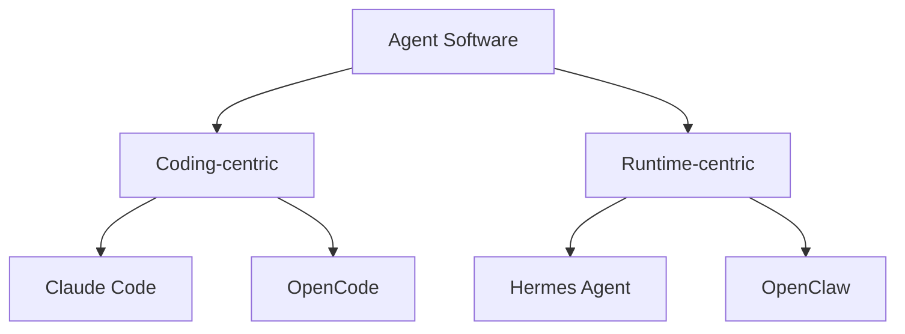
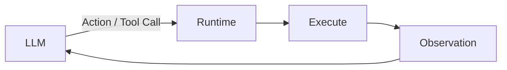
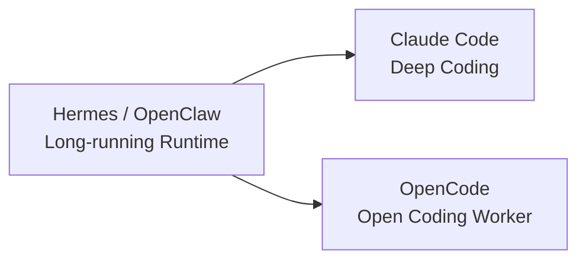

# 11 · Hermes、Claude Code、OpenCode、OpenClaw：架构定位对比

> **事实核验基线：2026-07-21**  
> 术语规范见 [reference/terminology.md](../reference/terminology.md)。  
> 这是一个快速演进领域。本篇不使用“✅/❌ 功能清单”作为主要结论，而比较能力是否原生、处于什么架构层，以及系统主要优化什么。

## 1. 先分清比较层级



这只是主要定位，不代表互斥。

- Claude Code 也有子代理（Subagents）、Agent Teams、Skills、MCP 和 Memory。
- OpenCode 也有 Server、Sessions、子代理（Subagents）、Skills 和 MCP。
- Hermes 也可以深度 Coding。
- OpenClaw 也能调用 Coding Agent。

## 2. 底层 Agent Loop：其实高度相似

四者最终都遵循：



真正差异不在“谁会 Tool Call”，而在：

- Context 怎样构建；
- 长期状态怎样管理；
- 是否围绕常驻 Gateway 设计；
- 多代理 如何协调；
- 自动化是否是一等能力；
- 权限治理有多深。

## 3. 高层比较

| 维度 | Hermes | Claude Code | OpenCode | OpenClaw |
|---|---|---|---|---|
| 主要定位 | 长期个人 Agent Runtime | 专业 Coding Agent | 开源、多模型 Coding Agent | 常驻通用 Agent Gateway/Runtime |
| Skills | 原生、按需加载、自我改进链路 | 原生、按需、可与子代理组合 | 原生 `skill` Tool 按需加载 | 原生，多层 Workspace/Agent 体系 |
| 子代理 | 原生委派 | 原生且配置能力强 | 原生 Primary/Subagent | 原生 |
| 多代理 长期协调 | Kanban | Agent Teams（实验性） | 子 Session/Agent 为主 | 多代理 Routing/Orchestration |
| Memory | 小型内置 Memory + 可插拔 Provider | CLAUDE.md + Auto Memory / Agent Memory | 原生长期记忆不是核心 | Memory Files + Memory Search |
| Session Search | 原生 FTS Session Search | Resume/Fork 与 Memory 更突出 | Session Continue/Fork | sessions_search + sessions_history |
| Gateway / 多 Channel | 核心能力 | Channels 已进入 Research Preview，但不是产品主架构 | 非核心定位 | 核心能力 |
| Cron / 长期自动化 | 原生 Agent Cron | Hooks/外部自动化更强 | 可结合外部 CI | 常驻 Runtime 自动化能力 |
| MCP | Client；`hermes mcp serve` 暴露消息 Bridge | Client；`claude mcp serve` 暴露 Claude Code 工具 | Client 为重要扩展面 | Client/Runtime Integration |
| ACP | Agent Server | 不是主要产品定位 | ACP 能力 | 有外部 Harness/集成体系 |
| 安全重点 | Gateway + Tool + Sandbox + MCP + Persistent State | Permissions、Sandbox、Hooks、Enterprise Governance | Permission 配置简洁开放 | Gateway、Session、Sandbox、Channel |

表格应理解为“当前主要产品重心”，不是功能穷举。

## 4. Context Engineering

### Hermes

特点是明确区分：

```text
stable
context
volatile
ephemeral API-call-time layers
```

并把 Prompt Caching 当成架构约束。

### Claude Code

更强调代码库层级规则：

- CLAUDE.md；
- Rules；
- Skills；
- 子代理 Context；
- Hooks。

大型软件工程工作流成熟度很高。

### OpenCode

心智模型更轻：

- AGENTS.md；
- Skills；
- Agent Config；
- Session；
- Compaction。

适合快速定制。

### OpenClaw

Context 更像长期个人 Agent Workspace：

- Memory；
- Skills；
- Session；
- Agent Runtime；
- 长期消息 Gateway。

## 5. Skills

今天不能再说：

> “Hermes 有 Skill，而 Claude Code/OpenCode 没有。”

这已经过时。

真正差异是：

> **Hermes 把 Skill 直接放进 Self-improvement + Curator 生命周期。**

Claude Code 的 Skill 更偏成熟开发工作流资产。

OpenCode 的 Skill Loader 更轻、更兼容多个目录标准。

OpenClaw 则更强调 Workspace 和运行环境条件。

## 6. Memory

### Hermes

```text
Bounded Memory
+
External Memory Provider
+
Session Search
```

### Claude Code

```text
CLAUDE.md
+
Auto/Agent Memory
+
Session Resume/Fork
```

### OpenCode

长期 Memory 不是当前官方核心主线，更多依赖 Session、Rules、Skills 或扩展生态。

### OpenClaw

```text
MEMORY.md
+
Daily Notes
+
memory_search
+
sessions_search
```

OpenClaw 是 Hermes 最值得认真对比的 Runtime-centric 系统之一。

## 7. 子代理与多代理

Claude Code 的 Subagent 系统目前非常成熟：

- 独立 Context；
- 自定义 Model；
- Tools；
- Permissions；
- Skills；
- Memory；
- Worktree Isolation。

OpenCode 也区分 Primary Agent 和 Subagent。

Hermes 的特点在于：

> 临时 `delegate_task` 之外，还有持久化 Kanban Board，把多个 Profile 变成长期 Worker。

OpenClaw 则更偏长期 Agent Routing 与 Runtime Coordination。

## 8. Gateway

这是 Hermes 与 Coding-centric Agent 差异最明显的层之一。

Hermes 的 Gateway 是长期 Runtime 的核心：

```text
Platform Connection
→ Authorization
→ Session Routing
→ Agent Run
→ Delivery
```

OpenClaw 也处于相似层级。

Claude Code 已提供 Channels Research Preview，可通过 MCP Channel 接收 Telegram、Discord、iMessage 或 Webhook 事件；但它仍不是以“多 Profile、常驻消息 Gateway”作为主产品中心。OpenCode 的主要定位仍是 Coding Agent。

## 9. MCP

错误的比较：

> “只有 Hermes 能做 MCP Server。”

更准确：

> **不同系统通过 MCP 暴露的 Surface 不同。**

Hermes 的 MCP Server 有价值的地方，是围绕 Gateway 和消息会话暴露 Runtime 能力；Claude Code 的 MCP Server 则主要暴露 View、Edit、LS 等 Claude Code Tool。

Claude Code 的 MCP 生态则主要服务软件开发工具链。

## 10. 自动化

Hermes 的 Cron 属于 Agent Runtime 内部的一等调度能力。

Claude Code 更强调：

- Hooks；
- CI；
- SDK；
- 外部调度。

OpenCode 可以结合 GitHub Actions 等外部系统。

OpenClaw 作为常驻 Runtime，也有自己的长期自动化体系。

因此比较时应区分：

```text
内置 Scheduler
外部 Scheduler
事件 Hook
Channel Delivery
Scale-to-zero
```

而不是简单写“有定时 / 没定时”。

## 11. 安全

### Claude Code

优势在成熟开发者产品的权限治理、Sandbox、Hooks 和企业控制。

### Hermes

攻击面更广，因为它可能同时拥有：

- Shell；
- Gateway；
- Cron；
- Memory/Skill Write；
- MCP；
- Kanban Worker；
- Computer Use。

因此需要更重视长期 Runtime Security。

### OpenCode

权限模型直接、易定制，适合开发者自己组合。

### OpenClaw

长期 Gateway 与多代理 场景同样要求更复杂的 Session/Channel 安全模型。

## 12. 怎样选

### 主要需求是专业软件开发体验

优先研究 Claude Code。

### 想要开放、多模型、轻量可改的 Coding Agent

优先研究 OpenCode。

### 想要长期运行、跨入口、自我积累 Skills/Memory 的 Runtime

Hermes 很值得研究。

### 想要常驻、多 Channel、长期个人 Agent Gateway

OpenClaw 是 Hermes 最重要的同层级对照对象之一。

## 13. 更合理的组合

工具不一定互斥。

例如：



长期 Agent Runtime 可以负责：

- 消息；
- 自动化；
- 调度；
- 状态；
- 任务分配。

Coding Agent 专注深度软件工程。

这通常比强行选择“一种 Agent 包办所有工作”更合理。

## 需要定期复查的竞品事实

- Claude Code Agent Teams 目前仍为 Experimental，默认关闭；
- Claude Code Channels 目前为 Research Preview；
- OpenCode 的 Session、Server、ACP 与 Skills 发展很快；
- OpenClaw 的 Memory、Gateway 与多代理路由 仍在高频演进。

因此本篇必须保留明确日期，不能被视为长期不变的功能矩阵。

## 主要来源

- Hermes: `https://hermes-agent.nousresearch.com/docs/`
- Claude Code: `https://code.claude.com/docs/`
- OpenCode: `https://opencode.ai/docs/`
- OpenClaw: `https://docs.openclaw.ai/`
