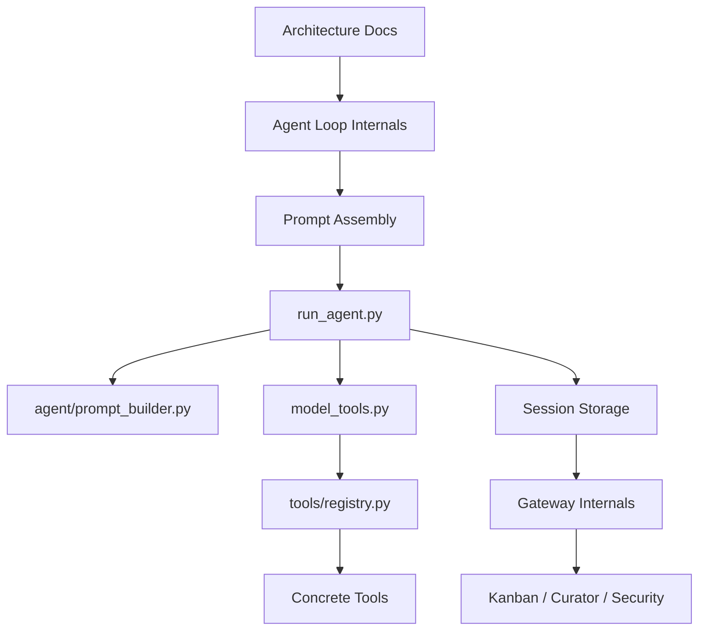
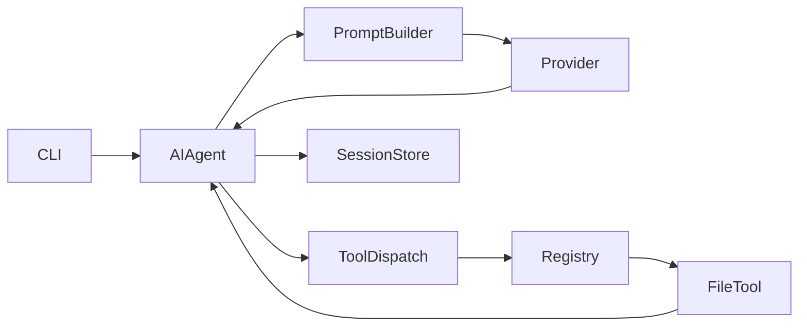

# Reference · Hermes 源码学习地图

> **目标**：给准备阅读 Hermes 源码的人一条不会一开始就淹没在巨型文件中的路线。  
> **事实核验基线**：2026-07-21。源码路径应与具体 release 或 commit SHA 一起使用。

## 1. 最推荐的顺序



先抓“控制流”，再抓“数据流”，最后抓“扩展面”。

## 2. 概念 → 源码地图

| 概念 | 首选入口 |
|---|---|
| 顶层架构 | `website/docs/developer-guide/architecture.md` |
| Agent Loop | `website/docs/developer-guide/agent-loop.md`、`run_agent.py` |
| Prompt Assembly | `website/docs/developer-guide/prompt-assembly.md`、`agent/prompt_builder.py` |
| Context Engine | `agent/context_engine.py` |
| Compression | `agent/context_compressor.py` |
| Prompt Caching | `agent/prompt_caching.py` |
| Tool Orchestration | `model_tools.py` |
| Tool Registry | `tools/registry.py` |
| Toolsets | `toolsets.py` |
| Session Storage | Session Storage Developer Guide、`hermes_state.py` |
| Provider Runtime | Provider Runtime Resolution 文档与 `agent/` 适配层 |
| Gateway | Gateway Internals、`gateway/run.py` |
| Profile Path | `hermes_constants.py`、Profile 文档 |
| Memory | Memory 文档、`agent/memory_manager.py`、Memory Tool |
| Skills | Skills 文档、Skill Manager/Guard |
| Curator | Curator 文档与对应维护模块 |
| 子代理 / Subagent | `delegate_task` / delegate tool 实现 |
| Kanban | Kanban 文档、Kanban Plugin/DB/Dispatcher |
| MCP | MCP 文档、MCP Client 与 `mcp_serve.py` |
| ACP | `acp_adapter/`、ACP Internals |
| Security | Security 文档、Approval/Guard/Sandbox 相关模块 |

## 3. 第一阶段：只建立边界

第一遍不要追函数细节。

只回答：

```text
这个模块负责什么？
输入是什么？
输出是什么？
状态存在哪里？
谁调用它？
它调用谁？
```

## 4. 第二阶段：追一条完整调用链

推荐从一个简单请求开始：



尝试在源码里把每个箭头找到。

## 5. 第三阶段：专题阅读

### Context Engineering

看：

```text
Prompt Assembly
agent/prompt_builder.py
agent/prompt_caching.py
agent/context_compressor.py
```

目标：理解 stable/context/volatile 和 ephemeral layers。

### Tool System

看：

```text
Tools Runtime
model_tools.py
tools/registry.py
toolsets.py
```

再选：

```text
memory
session_search
delegate_task
```

各追一次。

### Long-running Runtime

看：

```text
Gateway Internals
Session Storage
Profiles
Security
```

目标：理解为什么长期 Gateway 与一次 CLI Agent 是两个复杂度等级。

### Self-improvement

看：

```text
Memory
Skills
Skill Manager
Skills Guard
Curator
```

目标：理解“学习”与“治理”是两套机制。

### 多代理

看：

```text
delegate_task
Kanban
Profile description/routing
Dispatcher
Worker Toolset
```

目标：区分临时 Delegation 和持久化 Orchestration。

## 6. 不建议的起手方式

### 从 gateway/run.py 第一行顺序读

Gateway 通常是大型长期生命周期文件，包含太多外围问题。

### 先读 Provider 全表

这会让你陷入适配器细节，而没有主循环心智模型。

### 记精确行号

源码变化快。

更推荐：

```text
commit SHA
module path
symbol name
```

## 7. 建议固定版本

学习架构时先选择：

```text
稳定 Release Tag
或
明确 Commit SHA
```

完成第一遍理解后，再对比 `main`。

否则你会同时面对：

- 学习复杂系统；
- 追逐持续重构。

## 8. 一个实际练习

选择一个任务：

> “读取 README 并总结。”

然后追踪：

```text
入口
→ Session
→ Prompt Builder
→ Provider
→ Tool Schema
→ read_file Tool
→ Tool Result
→ 第二次 Provider Call
→ Persist
```

当这条链能在脑中连起来，你已经真正进入 Hermes 源码，而不是只在浏览文件。

## 9. 下一步阅读

- `https://hermes-agent.nousresearch.com/docs/developer-guide/architecture`
- `https://hermes-agent.nousresearch.com/docs/developer-guide/agent-loop`
- `https://hermes-agent.nousresearch.com/docs/developer-guide/prompt-assembly`
